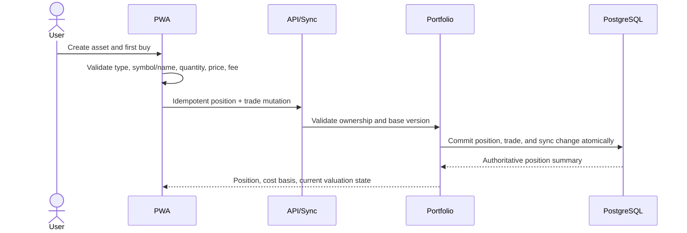

# DETAIL DESIGN: Asset Portfolio and Market Valuation

## Review Status

- Ticket: TICKET-027
- Status: approved
- Approval: approved by owner on 2026-08-31
- Implementation gate: open; execution may begin after the current documentation reconciliation
- Sequencing: immediately after TICKET-017; TICKET-018 through TICKET-026 remain deferred

## Decisions Required From Review

| ID | Decision | Recommendation / approved direction | Status |
| --- | --- | --- | --- |
| D-01 | Current-price source | Hybrid per-position `pricing_mode`: `automatic` uses scheduled backend provider adapters and still permits one-off manual snapshots; `manual` skips the job. Every snapshot records source/time, latest observation wins, and provider failure preserves the latest known value. | Approved by owner on 2026-08-31 |
| D-02 | Disposal scope | Support buy and sell using moving weighted-average cost so quantity can decrease and realized P&L is deterministic; defer FIFO/tax-lot selection. | Approved by owner on 2026-08-31 |
| D-03 | Dashboard total | Show wallet net worth, investment value, and combined net worth as three separate values. | Approved by owner on 2026-08-31 |
| D-04 | Offline writes | Queue asset, buy/sell, and manual-price mutations offline; provider refresh remains an online backend job. | Approved by owner on 2026-08-31 |

D-01 through D-04 are locked. Provider vendors and symbol mappings remain implementation/configuration choices behind the approved adapter boundary.

## 1. Context And Scope

### Problem Statement

The current `wallets.balance_vnd` model represents money accounts. Treating gold, stocks, crypto, or foreign currency as savings wallets loses acquisition price, quantity, market-price history, and unrealized P&L. Manual wallet balance adjustment also corrupts the distinction between cash accounting and market valuation.

Success means a user can preserve how much of an asset was acquired, what it cost, what it is worth at a chosen time, and how much unrealized value changed, while wallet accounting remains untouched.

### Context Loaded

- `docs/CONTEXT.md`
- `docs/work/BACKLOG.md`
- `docs/standards/README.md`
- `docs/standards/QUALITY_BAR.md`
- `docs/standards/VALIDATION.md`
- `docs/work/phases/PHASE-005-analytics-dashboard.md`
- `docs/work/phases/PHASE-005-detail-design.md`
- `docs/work/tickets/TICKET-017-analytics-reports-cumulative-trends.md`
- `docs/requirements/REQUIREMENTS.md`
- `docs/architecture/ARCHITECTURE.md`
- `docs/architecture/ERD.md`
- `design/DESIGN.md`

### Brownfield Scope

- Touched backend modules: new `portfolio` domain and repository; existing `analytics`, `sync`, HTTP router, migrations, and worker adapter boundary.
- Touched frontend modules: `frontend/src/app`, new portfolio API/types/components, `frontend/src/offline`, and existing privacy/navigation state.
- Contracts affected: PostgreSQL schema, REST API, IndexedDB schema, sync entity enum/change feed, dashboard aggregate.
- Known unknowns: provider choice and provider-specific legal/rate-limit behavior; gold market convention; stock exchange symbol normalization. Sell accounting is locked to moving weighted average by D-02.
- Scope expansion reason: the owner explicitly promoted asset valuation immediately after TICKET-017 for direct testing.

### Small Task Exemption

- Small task exemption: no
- Reason: New domain, schema, API, sync, analytics, and PWA behavior.
- Impact checked: API=yes, DB=yes, Security=yes, Runtime=yes, Standards=no

## 2. Design Considerations And Trade-offs

| Consideration / Alternative | Pros | Cons | Decision |
| --- | --- | --- | --- |
| Reuse `wallets` for assets | Minimal schema/UI | Conflates cash with valuation, cannot model quantity/trades/prices | Rejected |
| Store only current market value | Smallest implementation | Loses cost basis and price history | Rejected |
| Store asset positions plus ordered trades and append-only prices | Correct cost/realized P&L, auditable valuation, provider-ready | Three tables and broader sync work | Chosen |
| FIFO/tax-lot selection | Tax-lot precision | More UI and jurisdiction-sensitive behavior | Rejected for TICKET-027; moving weighted average is chosen by D-02 |
| Floating-point quantities | Simple application code | Precision loss for crypto and fractional holdings | Rejected |
| PostgreSQL `numeric(30,12)` quantities and integer VND prices | Precise quantities, VND-compatible reporting | Requires explicit JSON decimal strings | Chosen |
| Frontend computes financial totals | Fast UI iteration | Creates divergence across clients | Rejected |
| Backend returns derived portfolio summaries | One authoritative formula and rounding policy | More API/domain tests | Chosen |
| Provider-only automatic pricing | Convenient current values | Gaps for unsupported symbols and provider outages | Rejected; D-01 requires manual entry as a permanent fallback |
| Hybrid scheduled provider refresh plus manual snapshots | Automatic updates with user control and recoverability | Requires source precedence, adapter tests, leases, and stale-state UI | Chosen by D-01 |

## 3. Architecture Overview

```text
+-----------------------+       REST/sync       +-----------------------+
| React PWA             | --------------------> | Go portfolio module   |
| Portfolio UI          | <-------------------- | validation + formulas |
| IndexedDB + outbox    |                       +-----------+-----------+
+-----------------------+                                   |
                                                            v
                                                +-----------------------+
                                                | PostgreSQL            |
                                                | positions / trades /  |
                                                | price history         |
                                                +-----------+-----------+
                                                            ^
                                                            |
                                                +-----------+-----------+
                                                | Price adapter boundary|
                                                | manual + scheduled    |
                                                | provider adapters     |
                                                +-----------------------+

Wallet accounting -------------------- no write dependency -------------------- Portfolio valuation
```

### Component Responsibilities

| Component | Role |
| --- | --- |
| `backend/internal/portfolio` | Ownership validation, decimal parsing, cost basis, latest-price selection, market value, P&L, archive rules. |
| Portfolio repository | Transactional position/trade/price persistence and user-scoped queries. |
| Portfolio HTTP handlers | Stable authenticated JSON contract, CSRF on mutations, idempotency/correlation envelopes. |
| Existing analytics module | Read portfolio summary only; keep wallet totals independently visible. |
| Existing sync module | Add position, trade, and price mutation/change types with optimistic versions and explicit conflicts. |
| Price adapter boundary | Normalize provider results to VND unit-price snapshots; isolate vendor-specific symbols, credentials, rate limits, and errors. |
| Portfolio refresh worker | Acquire a bounded lease, refresh eligible positions, append idempotent snapshots, and preserve the last known value on failure. |
| React portfolio surfaces | Compact list/detail/editor, valuation states, privacy mask, offline/pending/conflict feedback. |
| IndexedDB portfolio stores | Cached read model and durable mutation outbox scoped to the authenticated user. |

## 4. Domain And Calculation Contract

### Supported Types And Units

| Type | Required identity | Allowed default unit | Example |
| --- | --- | --- | --- |
| `gold` | Name; optional market symbol | `gram`, `tael`, `ounce` | SJC 9999, 2 tael |
| `stock` | Symbol and exchange | `share` | FPT / HOSE, 100 shares |
| `crypto` | Symbol; optional network | `token` | BTC, 0.025 token |
| `foreign_currency` | ISO currency code | `unit` | USD, 500 units |
| `other` | Name | `unit` | Custom tracked asset |

Quantity is transported as a decimal string and stored as `numeric(30,12)`. VND money fields remain signed/unsigned `bigint` according to their contract; user inputs for price, fee, and cost must be non-negative integers.

### Derived Values

Active trades are replayed by `(occurred_at ASC, created_at ASC, id ASC)` using moving weighted-average cost:

```text
BUY:
  quantity_after = quantity_before + trade_quantity
  cost_basis_after = cost_basis_before
                   + round(trade_quantity * unit_price_vnd)
                   + fee_vnd
  average_cost_after = cost_basis_after / quantity_after

SELL:
  require trade_quantity <= quantity_before
  removed_cost_vnd = round(average_cost_before * trade_quantity)
  proceeds_vnd = round(trade_quantity * unit_price_vnd) - fee_vnd
  realized_pnl_vnd = proceeds_vnd - removed_cost_vnd
  quantity_after = quantity_before - trade_quantity
  cost_basis_after = cost_basis_before - removed_cost_vnd

VALUATION:
  market_value_vnd = round(quantity * latest_price.unit_price_vnd)
  unrealized_pnl_vnd = market_value_vnd - cost_basis_vnd
  unrealized_pnl_percent = unrealized_pnl_vnd / cost_basis_vnd * 100
```

- Rounding uses half-away-from-zero to the nearest integer VND and is implemented once in Go.
- If no current price exists, market value and P&L are `null`, never zero.
- If cost basis is zero, percentage P&L is `not_comparable`, never infinity.
- Latest price is selected by `(priced_at DESC, created_at DESC, id DESC)`.
- Archived positions/trades are excluded from active totals but retained for history; correcting or archiving a historical trade recomputes every later trade deterministically.
- A sell that would make quantity negative is rejected.
- Asset operations never call the finance transaction accounting service.

## 5. Execution Flows

### Create Position And First Buy



### Record Current Price

1. User opens a position and selects `Cập nhật giá`.
2. PWA submits VND price, valuation timestamp, and `source=manual` with an idempotency key.
3. Backend appends a price row; it never overwrites history.
4. Backend recalculates the position summary and portfolio total.
5. PWA updates list/detail/dashboard caches and shows the valuation timestamp.
6. Offline submission stays pending and may conflict if the position was archived or its version changed.

### Scheduled Provider Refresh

1. The worker acquires a bounded portfolio-price refresh lease and selects due positions with configured provider mappings.
2. Worker/provider adapter resolves a canonical instrument key.
3. Adapter returns price, quote currency, observation time, and provider quote ID.
4. Backend rejects invalid quotes and converts only through an explicitly configured VND quote path.
5. A provider snapshot is appended idempotently by `(provider, provider_quote_id)`.
6. Provider failure records a safe refresh status, preserves the last known price, and retries with a bounded backoff; it never writes zero.
7. A later manual snapshot remains valid and participates in the same latest-price ordering instead of being overwritten by the job.
8. Positions in `pricing_mode=manual` are never selected by the refresh job; users may switch modes explicitly.

## 6. API Design

All routes require the existing authenticated cookie. Mutations require the existing CSRF and idempotency conventions.

| Method | Path | Purpose |
| --- | --- | --- |
| `GET` | `/api/v1/assets` | List active positions with latest derived valuation; optional archived/type filter. |
| `POST` | `/api/v1/assets` | Create a position, optionally with its first buy trade. |
| `GET` | `/api/v1/assets/{asset_id}` | Position detail, active trades, realized P&L, latest price, and bounded price history. |
| `PATCH` | `/api/v1/assets/{asset_id}` | Rename, update metadata, toggle net-worth inclusion, or archive metadata using `base_version`. |
| `POST` | `/api/v1/assets/{asset_id}/archive` | Archive position while retaining history. |
| `POST` | `/api/v1/assets/{asset_id}/trades` | Add a buy or sell and recompute the moving-average ledger. |
| `PATCH` | `/api/v1/assets/{asset_id}/trades/{trade_id}` | Correct a trade and deterministically recompute later trades using optimistic versioning. |
| `POST` | `/api/v1/assets/{asset_id}/trades/{trade_id}/archive` | Archive an erroneous trade and recompute; no physical delete. |
| `POST` | `/api/v1/assets/{asset_id}/prices` | Append a user-entered manual price snapshot. Provider snapshots are worker-only. |
| `GET` | `/api/v1/assets/{asset_id}/prices` | Return bounded price history by date range/cursor. |
| `GET` | `/api/v1/portfolio/summary` | Return wallet total reference, included investment value, combined net worth, and stale/missing-price counts. |

### Example Position Create Request

```json
{
  "type": "stock",
  "symbol": "FPT",
  "exchange": "HOSE",
  "name": "FPT Corporation",
  "unit": "share",
  "include_in_net_worth": true,
  "first_trade": {
    "side": "buy",
    "quantity": "100",
    "unit_cost_vnd": 125000,
    "fee_vnd": 15000,
    "acquired_at": "2026-08-31T09:00:00+07:00"
  }
}
```

### Example Derived Summary

```json
{
  "quantity": "100",
  "cost_basis_vnd": 12515000,
  "current_unit_price_vnd": 131000,
  "market_value_vnd": 13100000,
  "realized_pnl_vnd": 0,
  "unrealized_pnl_vnd": 585000,
  "unrealized_pnl_percent": "4.6743907311",
  "valuation_status": "current",
  "priced_at": "2026-08-31T15:00:00+07:00"
}
```

Stable error codes include `invalid_asset_type`, `invalid_asset_unit`, `invalid_quantity`, `invalid_price`, `asset_not_found`, `asset_version_conflict`, `asset_price_missing`, and `asset_archived`.

## 7. Data Model Design

### `asset_positions`

| Column | Type | Rule |
| --- | --- | --- |
| `id` | `uuid` | Primary key; client UUID accepted for offline create. |
| `user_id` | `uuid` | Required indexed owner. |
| `type` | `text` | Approved type enum. |
| `symbol`, `exchange`, `name` | `text` | Normalized identity; name required. |
| `unit` | `text` | Approved unit compatible with type. |
| `reporting_currency` | `text` | Fixed to `VND` in this ticket. |
| `pricing_mode` | `text` | `automatic` or `manual`; defaults manual when no provider mapping exists. |
| `provider_key`, `provider_symbol` | nullable text | Server-recognized mapping used only in automatic mode. |
| `include_in_net_worth` | `boolean` | Defaults true. |
| `archived_at` | `timestamptz` | Soft archive. |
| `version` | `bigint` | Optimistic version. |
| `created_at`, `updated_at` | `timestamptz` | Audit timestamps. |

Recommended uniqueness: active `(user_id, type, normalized_symbol, exchange, unit)` when symbol exists. Duplicate custom assets without symbols remain allowed by explicit user confirmation.

### `asset_trades`

| Column | Type | Rule |
| --- | --- | --- |
| `id` | `uuid` | Primary key; client UUID accepted. |
| `user_id`, `asset_id` | `uuid` | Same-user ownership enforced. |
| `side` | `text` | `buy` or `sell`. |
| `quantity` | `numeric(30,12)` | Strictly positive. |
| `unit_price_vnd`, `fee_vnd` | `bigint` | Non-negative integers. |
| `occurred_at` | `timestamptz` | User-supplied trade time and ledger order input. |
| `quantity_after`, `cost_basis_after_vnd`, `realized_pnl_vnd` | persisted derived values | Exact replay/audit result after this trade. |
| `note` | `text` | Bounded optional note. |
| `archived_at`, `version`, timestamps | standard | Preserve corrections/history. |

### `asset_price_history`

| Column | Type | Rule |
| --- | --- | --- |
| `id` | `uuid` | Primary key; client UUID accepted for manual snapshots. |
| `user_id`, `asset_id` | `uuid` | Same-user ownership enforced. |
| `unit_price_vnd` | `bigint` | Strictly positive. |
| `priced_at` | `timestamptz` | Observation time, not insertion time. |
| `source` | `text` | `manual` or approved provider key. |
| `provider_quote_id` | nullable text | Provider idempotency key. |
| `created_at` | `timestamptz` | Immutable insertion time. |

Price rows are append-only. A correction appends a replacement snapshot; it does not update/delete an earlier value. Manual duplicates use the mutation idempotency ledger; provider duplicates use a unique provider quote key.

### Migration And Rollback

- Add one forward migration after existing migration `0007`; final filename is selected at implementation time from the current migration head.
- No existing wallet/transaction data is transformed.
- Rollback is schema-destructive and therefore allowed only before production data exists or after verified backup/export.

## 8. Sync And Offline Contract

- Add IndexedDB stores for `asset_positions`, `asset_trades`, and bounded `asset_prices` plus a portfolio query cache.
- Extend entity types without changing existing wallet/category/transaction behavior.
- Offline create/edit/archive, buy/sell, and manual-price mutations use client UUID, mutation ID, base version, optimistic pending badges, and the current conflict inbox.
- Price history cache is bounded per position; server remains authoritative for full history.
- Cached valuations show `Đã cập nhật <time>` and `Đang offline`; no stale value is labelled current.
- Logout clears portfolio stores with all other user-scoped offline data.

## 9. Mobile And Web UI Contract

- Add `Tài sản` as a section inside the existing `Tài khoản` destination for the first slice; do not add a sixth bottom-nav destination.
- Overview gains one compact unframed investment summary row below `Ví của tôi`; wallet rows and asset rows never share the same grouped panel.
- Portfolio list rows show icon/type, name/symbol, quantity, market value, and P&L. Missing price shows `Chưa có giá hiện tại` instead of `0 đ`.
- Position detail uses compact grouped sections: current valuation, buy/sell history, realized P&L, price history, and actions.
- `Thêm tài sản`, `Mua`, `Bán`, and `Cập nhật giá` use mobile bottom sheets and constrained centered desktop dialogs.
- Editors use inputs/selects/segmented controls appropriate to each field; no oversized cards or instructional marketing copy.
- Preserve liquid-glass bottom navigation/sheet treatment on supported iPhone browsers, safe areas, 44px minimum touch targets, current compact typography, and transparent scrollbar styling.
- Privacy mode masks cost basis, market value, and P&L in DOM-visible text.

## 10. Security, Privacy, And Runtime

- Every query and mutation filters by authenticated `user_id`; same-user composite ownership is checked for position/trade/price relationships.
- Cross-user IDs return the existing non-enumerating not-found/forbidden contract.
- Decimal quantities are parsed from strings with fixed precision; floats are rejected at the API boundary.
- Symbols, exchange codes, notes, and provider payload fields are length-bounded and normalized; no provider raw response is stored or logged.
- Provider credentials remain server-only environment values; the PWA never receives them.
- Rate limits and bounded history prevent unbounded manual price spam.
- No asset endpoint can create a finance transaction or mutate `wallets.balance_vnd`.

## 11. Implementation And Verification Plan

### Impacted Areas

- Code/modules: portfolio domain/repository/HTTP, analytics summary, sync, frontend app/offline.
- Product behavior: asset valuation and combined net-worth display.
- API/contracts: new authenticated endpoints and sync entities.
- Data/schema: three new user-owned tables and indexes.
- Security/auth: ownership, CSRF, idempotency, optimistic conflicts.
- Deployment/runtime: provider registry and leased refresh job run server-side; unconfigured asset types remain manual-only without degrading the API.
- Docs: requirements, architecture, API, ERD, SDD, validation, design, context, backlog, changelog.

### Test Plan

- Unit: decimal normalization, compatible unit/type validation, ordered buy/sell replay, moving-average cost, fee inclusion, realized/unrealized P&L, oversell rejection, correction recomputation, VND rounding, latest price ordering, and missing/zero states.
- Integration: empty-database migration, ownership isolation, same-user FK rules, append-only prices, archive retention, idempotency, stale version conflict, no finance table mutations.
- Sync/offline: IndexedDB migration, optimistic CRUD, reconnect once, explicit conflict paths, bounded price cache, logout cleanup.
- Component/accessibility: compact mobile rows/sheets, missing/stale/pending/error states, privacy masking, keyboard labels, text containment.
- E2E/UAT fixture: gold with two buys and one partial sell, FPT stock, BTC; known manual/provider price snapshots; verify realized/unrealized P&L and combined totals on 390x844 and desktop.
- Regression: full backend, frontend unit/component, production build, existing PWA offline and finance/planning E2E.

### Validation Matrix Impact

- Update required: yes
- Rows: new REQ-F-018 plus REQ-NF-001/002/003/005/007 evidence references.
- Current status: planned; design and plan are not implementation evidence.

## 12. Failure Modes And Guardrails

| Failure | Required behavior |
| --- | --- |
| Missing current price | Return `market_value_vnd=null`; show a clear missing-price state. |
| Provider/manual quote older than latest | Preserve history; do not replace the latest valuation unless user views that historical time. |
| Duplicate mutation/quote | Return prior authoritative result without adding another row. |
| Precision overflow | Reject with stable validation error before persistence. |
| Position archived while offline mutation pending | Return explicit conflict; keep local intent recoverable. |
| Provider unavailable | Keep last known price with stale timestamp; do not write zero. |
| Cross-user asset ID | Return non-enumerating failure and no data. |
| Asset mutation accidentally touches wallet | Transactional integration test fails; release is blocked. |

## 13. Reconciliation Plan

- Requirements docs: REQ-F-018 is accepted by this approval; reconcile wording with buy/sell and hybrid pricing.
- Architecture docs: add portfolio module and one-way analytics read dependency.
- API docs: add request/response/error contracts.
- ERD docs: add three tables, relationships, ownership, precision, archive, and append-only constraints.
- SDD docs: add PHASE-005 extension mapping.
- ADR: approve or amend ADR-006.
- `design/DESIGN.md`: add the approved portfolio component contract during implementation reconciliation.
- Context/backlog/roadmap: record TICKET-027 immediately after TICKET-017 while TICKET-018..026 remain deferred.
- Changelog: add only after implementation reaches review.

## Docs Review Checklist

- Requirements updated or not needed reason: REQ-F-018 accepted and updated after direct human approval.
- Architecture updated or not needed reason: deferred until design approval/implementation reconciliation.
- API updated or not needed reason: endpoint draft lives here until approval.
- ERD/data updated or not needed reason: schema draft lives here until approval.
- SDD updated or not needed reason: deferred until approval.
- ADR created or not needed reason: ADR-006 created as proposed.

## Approval Result

D-01 through D-04 and the resulting MVP scope were approved directly by the owner on 2026-08-31. Implementation may proceed according to the linked plan.
