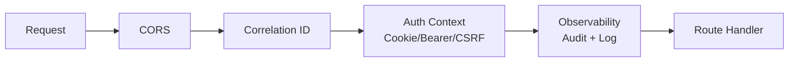
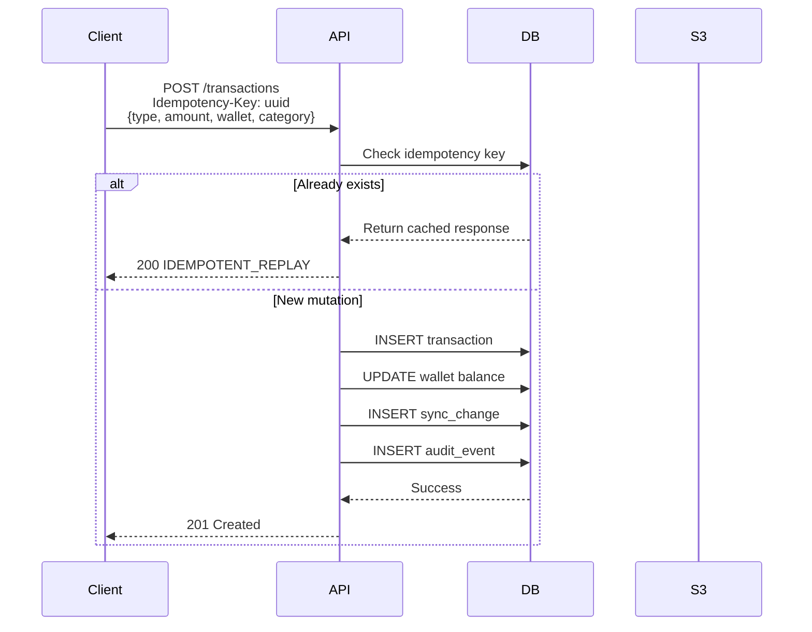
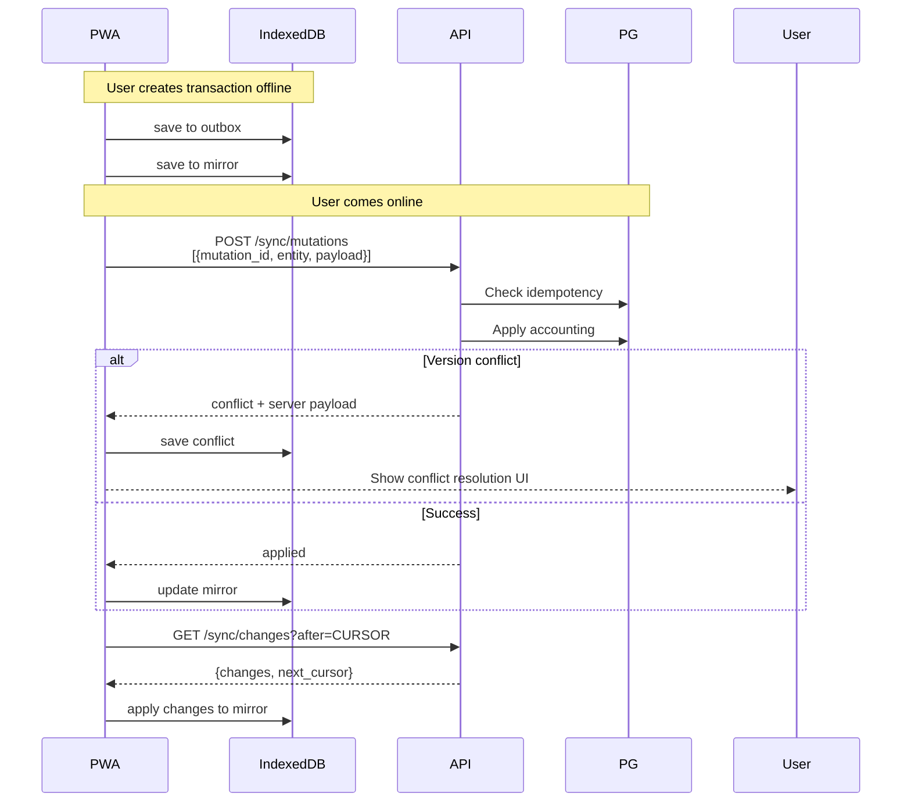

# API Overview

> Cập nhật 2026-09-11: tài chính, planning, portfolio, báo cáo, notification, sync, import/export, account lifecycle và Agent text/image đã có trong OpenAPI 3.1 máy đọc. OCR Platform được dùng nội bộ như image tool bên thứ ba; không có OCR proxy hoặc bank API.

**Base URL:** `/api/v1`

**Content-Type:** `application/json`

## Authentication methods

| Method | Header/Cookie | Áp dụng cho |
|--------|-------------|-------------|
| **Cookie** | `mypocket_auth` (HttpOnly, Secure, SameSite=Lax) | Browser (UI và automation) |
| **API Key** | `Authorization: Bearer mpk_...` | Third-party, server-to-server |

Mutations bằng cookie yêu cầu thêm `X-CSRF-Token` header. Với Bearer API key, không dùng CSRF.

### Quy tắc xác thực theo route

- Tất cả endpoint nghiệp vụ user-owned (`wallets`, `categories`, `transactions`, `planning`, `reports`, `assets`, `files`, `sync`, `notifications`, `budgets`, `imports`, `exports`, `agent`) chấp nhận cả cookie và Bearer API key, trừ reset/delete được OpenAPI giới hạn browser cookie.
- Không chấp nhận bearer cho: `GET /api/v1/auth/*`, `POST /api/v1/auth/logout`, `GET /api/v1/health/*`, docs pages, và route quản lý API key.

### Quy tắc phân quyền

- `user_id` luôn lấy từ context auth (cookie hoặc API key), không được đọc từ payload.
- Mọi truy vấn/mutation user-owned phải lọc theo `user_id` hiện tại.
- Truy cập tài nguyên user-owned không thuộc scope của caller được che bằng `404 NOT_FOUND`.
- Truy cập thiếu auth hợp lệ trả `401 AUTH_REQUIRED`.

## Response envelope

```json
{
  "status": "ok",
  "correlation_id": "req_abc123",
  "wallets": [ ... ]
}
```

Lỗi:
```json
{
  "status": "error",
  "error": { "code": "VALIDATION_FAILED", "message": "Description" },
  "correlation_id": "req_abc123"
}
```

## Common errors

| Error | HTTP | Ý nghĩa |
|-------|------|---------|
| `AUTH_REQUIRED` | 401 | Chưa login |
| `FORBIDDEN` | 403 | Không có quyền |
| `VALIDATION_FAILED` | 400 | Input không hợp lệ |
| `NOT_FOUND` | 404 | Object không tồn tại |
| `VERSION_CONFLICT` | 409 | base_version cũ |
| `RATE_LIMITED` | 429 | Chờ số giây trong `Retry-After` |
| `IDEMPOTENT_REPLAY` | 200 | Mutation đã được xử lý |
| `ASSET_OVERSELL` | 400 | Bán vượt quá số lượng |
| `UPLOAD_REJECTED` | 400 | File không hợp lệ |
| `INTERNAL_RETRYABLE` | 503 | Lỗi tạm thời, retry |
| `INTERNAL_FAILURE` | 500 | Lỗi không xác định |

## Middleware stack



## Sequence diagram — Create transaction



## Redis cache và Audit

Redis là lớp cache/hint cho xác thực:

- Lưu hint API key hash → `user_id`; PostgreSQL vẫn xác nhận key active trên từng Bearer request
- Lookup token/cookie đã ký
- TTL ngắn; miss/lỗi/stale Redis không thể thay thế PostgreSQL (nguồn dữ liệu chính)

Audit event **không** truy xuất từ Redis như nguồn chính. Các event thay đổi trạng thái/sự kiện bảo mật được ghi vào PostgreSQL append-only.

`/api/v1/audit/access` và `/api/v1/audit/events` là route đọc-only riêng biệt. Chỉ tài khoản có email trùng chính xác `AUDIT_VIEWER_EMAIL` mới được truy cập sau xác thực thành công.

## Sequence diagram — Offline sync flow


