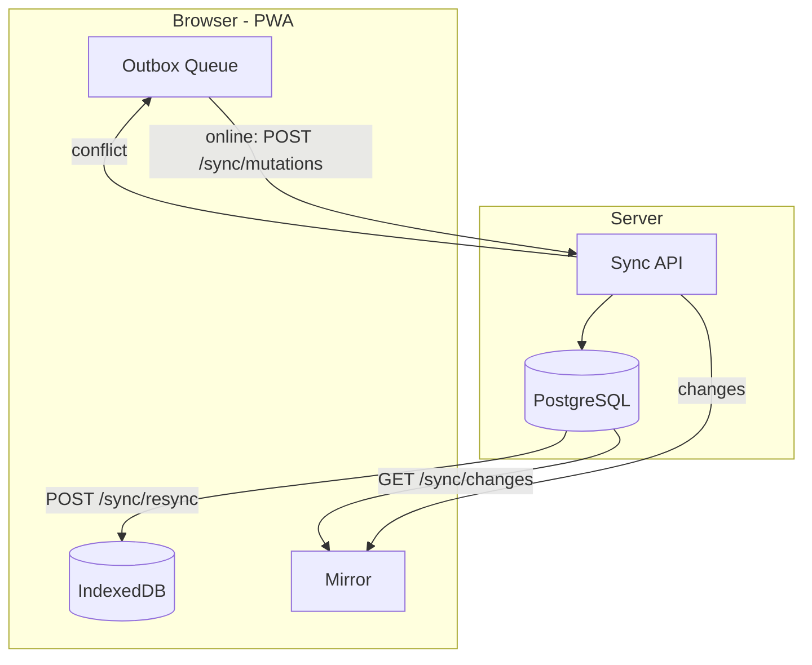
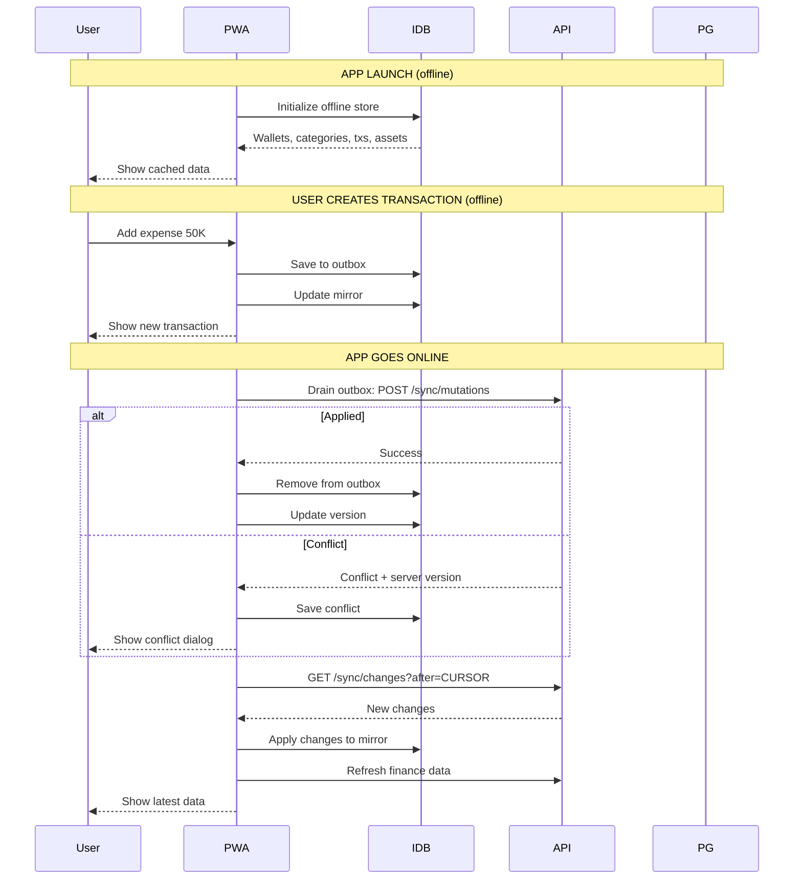

# Sync API

Khi phản hồi bị mất sau server commit, UI đối chiếu dòng chờ bằng **entity ID**, không dùng mutation ID làm ID giao dịch. Một giao dịch đã xác nhận chỉ hiển thị một lần; edit chờ được ghép vào đúng dòng và archive chờ ẩn dòng. Mutation ví/nhóm/tài sản không được hiển thị thành giao dịch. Đây là bản sửa local ngày 11/09/2026.

Hệ thống đồng bộ offline cho phép PWA hoạt động full read/write khi offline, đồng bộ khi online.

## Authentication

- `POST /sync/mutations` và `POST /sync/resync` là mutation: dùng cookie + `X-CSRF-Token`, hoặc Bearer API key.
- `GET /sync/changes` là read endpoint: dùng cookie hoặc Bearer API key.
- Quy tắc ownership giống các API nghiệp vụ: dữ liệu chỉ thuộc `user_id` của principal.

## Kiến trúc



## Apply mutations

```http
POST /api/v1/sync/mutations
X-CSRF-Token: ...
```

```json
{
  "mutations": [
    {
      "mutation_id": "uuid",
      "device_id": "browser-device-id",
      "sequence": 1,
      "entity_type": "transaction",
      "entity_id": "uuid",
      "operation": "create",
      "base_version": 0,
      "payload": {
        "type": "expense",
        "source_wallet_id": "uuid",
        "category_id": "uuid",
        "amount_vnd": 45000,
        "occurred_at": "2026-08-31T00:00:00Z",
        "note": "Cafe"
      }
    }
  ]
}
```

### Mutation results

| State | Mô tả |
|-------|-------|
| `applied` | Thành công, mutation được áp dụng |
| `replayed` | Mutation ID đã được xử lý — replay response cũ |
| `rejected` | Validation fail |
| `conflict` | Version conflict — kèm server payload |

### Conflict resolution

Khi conflict, PWA lưu conflict entry và cho user chọn:

- **Keep server**: bỏ local change, accept server version
- **Edit and retry**: sửa local payload, gửi mutation mới
- **Discard local**: bỏ local change hoàn toàn

## Change feed

```http
GET /api/v1/sync/changes?after=0&limit=100
```

```json
{
  "changes": [
    {
      "cursor": 1,
      "entity_type": "transaction",
      "entity_id": "uuid",
      "operation": "create",
      "version": 1,
      "payload": {}
    }
  ],
  "next_cursor": 42
}
```

- Feed per-user, monotonic cursor
- `after`: cursor cuối cùng client có, default 0
- `limit`: max rows, default 100

### Tính nhất quán và retry — bản cập nhật local

Mỗi mutation commit dữ liệu nghiệp vụ, các change và kết quả replay trong cùng transaction. Lỗi trước commit rollback toàn bộ. Khi mất phản hồi, gửi lại **nguyên mutation ID và payload** để nhận `replayed` nếu lần trước đã thành công. Không đổi sang lệnh tạo giao dịch mới.

Batch commit từng mutation độc lập. Nếu mạng lỗi giữa batch, phần đầu có thể đã commit; gửi lại batch không đổi để replay phần đó. Tái sử dụng mutation ID với request khác trả `rejected`.

Lệnh ví/category/giao dịch/tài sản qua REST, xác nhận draft và cập nhật giá từ worker đều ghi change. Chuyển tiền tạo change cho cả hai ví và giao dịch; đọc theo `next_cursor`, không giả định một mutation chỉ có một change. Archive phát tombstone có ID/version. Payload `set_category_active` là setting (`wallet_id`, `active`), không được dùng thay thế category.

Bản sửa yêu cầu migration 0012 trước khi nâng cấp API/worker. Sau nâng cấp, gọi `/sync/resync` một lần để lấy cả dữ liệu cũ từng thiếu trong feed. Đây là thay đổi đã kiểm chứng local, chưa xác nhận triển khai production.

## Resync

```http
POST /api/v1/sync/resync
X-CSRF-Token: ...
```

Trả về snapshot đầy đủ từ PostgreSQL:
- wallets, categories, transactions, assets
- `next_cursor`: cursor hiện tại

Snapshot và cursor được đọc trong cùng database snapshot. Thay đổi sau thời điểm đó được lấy tiếp qua change feed.

## Sequence diagram — Offline workflow


