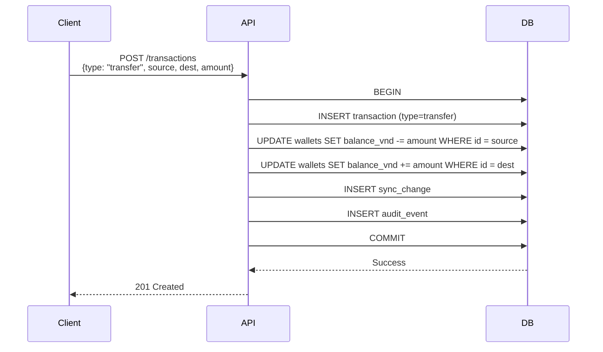

# Wallets API

## OpenAPI Spec

```yaml
openapi: 3.0.0
info:
  title: MyPocket Wallets API
  version: v1
paths:
  /api/v1/wallets:
    get:
      summary: Danh sách ví
      security: [{ cookieAuth: [], bearerAuth: [] }]
      responses:
        "200":
          description: Danh sách ví
          content:
            application/json:
              schema:
                type: object
                properties:
                  wallets:
                    type: array
                    items: { $ref: "#/components/schemas/Wallet" }
    post:
      summary: Tạo ví mới
      security: [{ cookieAuth: [], csrf: [] }, { bearerAuth: [] }]
      requestBody:
        required: true
        content:
          application/json:
            schema: { $ref: "#/components/schemas/CreateWalletInput" }
      responses:
        "201": { description: "Created" }
  /api/v1/wallets/{id}:
    patch:
      summary: Cập nhật ví
      security: [{ cookieAuth: [], csrf: [] }, { bearerAuth: [] }]
      parameters:
        - name: id
          in: path
          required: true
          schema: { type: string, format: uuid }
      requestBody:
        content:
          application/json:
            schema: { $ref: "#/components/schemas/UpdateWalletInput" }
      responses:
        "200": { description: "OK" }
        "409": { description: "VERSION_CONFLICT" }
  /api/v1/wallets/{id}/archive:
    post:
      summary: Lưu trữ ví
      security: [{ cookieAuth: [], csrf: [] }, { bearerAuth: [] }]
      requestBody:
        required: true
        content:
          application/json:
            schema: { $ref: "#/components/schemas/VersionCommand" }
      responses:
        "200": { description: "OK" }
        "409": { description: "VERSION_CONFLICT" }
  /api/v1/wallets/{id}/default-ai:
    post:
      summary: Set ví mặc định cho AI
      security: [{ cookieAuth: [], csrf: [] }, { bearerAuth: [] }]
      requestBody:
        required: true
        content:
          application/json:
            schema: { $ref: "#/components/schemas/VersionCommand" }
      responses:
        "200": { description: "OK" }
        "409": { description: "VERSION_CONFLICT" }
components:
  schemas:
    Wallet:
      type: object
      properties:
        id: { type: string, format: uuid }
        name: { type: string, example: "Ví chính" }
        type: { type: string, enum: ["basic", "goal", "credit"] }
        balance_vnd: { type: integer, example: 120000 }
        include_in_total: { type: boolean }
        is_default_ai: { type: boolean }
        credit_limit_vnd: { type: integer, nullable: true }
        statement_day: { type: integer, nullable: true, minimum: 1, maximum: 31 }
        payment_due_day: { type: integer, nullable: true, minimum: 1, maximum: 31 }
        goal_target_vnd: { type: integer, nullable: true }
        goal_deadline_on: { type: string, format: date, nullable: true }
        version: { type: integer }
    CreateWalletInput:
      type: object
      required: [name, type]
      properties:
        name: { type: string, minLength: 1 }
        type: { type: string, enum: ["basic", "goal", "credit"] }
        credit_limit_vnd: { type: integer, nullable: true }
        statement_day: { type: integer, nullable: true, minimum: 1, maximum: 31 }
        payment_due_day: { type: integer, nullable: true, minimum: 1, maximum: 31 }
        goal_target_vnd: { type: integer, nullable: true, minimum: 1 }
        goal_deadline_on: { type: string, format: date, nullable: true }
    UpdateWalletInput:
      type: object
      required: [name, include_in_total, base_version]
      properties:
        name: { type: string }
        include_in_total: { type: boolean }
        base_version: { type: integer, minimum: 1 }
    VersionCommand:
      type: object
      required: [base_version]
      properties:
        base_version: { type: integer, minimum: 1 }
```

Ví archived bị ẩn khỏi danh sách thường và không còn là ví mặc định AI. Giao dịch lịch sử vẫn được giữ để bảo toàn audit/accounting, nhưng trở thành read-only vì hệ thống không có lệnh restore ví và không cho reversal áp dụng vào ví không còn active.

Lệnh bật/tắt category theo ví là `PUT` đặt trạng thái tuyệt đối và idempotent. Setting hiện chưa có version riêng; nếu hai thiết bị đặt hai trạng thái đối nghịch đồng thời thì commit sau cùng thắng.

## Schema

### Wallet types

| type | Mô tả | Metadata |
|------|-------|----------|
| `basic` | Ví thường, chỉ quản lý số dư | — |
| `goal` | Ví mục tiêu / hũ tiết kiệm | `goal_target_vnd`, `goal_deadline_on` |
| `credit` | Thẻ tín dụng | `credit_limit_vnd`, `statement_day`, `payment_due_day` |

`type` là hành vi của ví, không phải nhãn kênh thanh toán. Dữ liệu cũ được migrate: `cash`, `bank`, `e_wallet`, `debt` → `basic`; `savings` → `goal`; `credit` giữ nguyên. Khoản vay/nợ là obligation/category, không còn là wallet type.

### Balance calculation

```
income  → balance_vnd += amount_vnd
expense → balance_vnd -= amount_vnd
transfer → source -= amount_vnd, dest += amount_vnd
adjustment → balance_vnd = target_balance_vnd
```

## Sequence diagram — Transfer



## Error codes

| Code | HTTP | Điều kiện |
|------|------|-----------|
| `AUTH_REQUIRED` | 401 | No cookie/Bearer |
| `VALIDATION_FAILED` | 400 | Name empty, type invalid |
| `NOT_FOUND` | 404 | Wallet ID không tồn tại |
| `VERSION_CONFLICT` | 409 | base_version stale |
