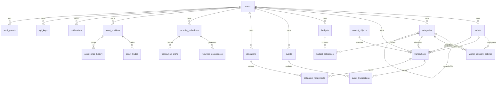

# Sơ đồ cơ sở dữ liệu

MyPocket sử dụng PostgreSQL 16 làm hệ quản trị cơ sở dữ liệu chính. Dữ liệu được tổ chức theo hướng multi-tenant, mỗi bản ghi thuộc về một user.

## Nguyên tắc thiết kế

- Mọi bản ghi tài chính đều có `user_id` — phân quyền ở tầng service
- Tiền tệ dùng **VND integer (minor units)** — không dùng float
- Mọi entity có `version` để optimistic locking cho offline sync
- Xoá mềm (archive) thay vì xoá vật lý — ngoại trừ tài khoản
- Audit log append-only, không có update/delete
- Idempotency key cho mutation retry-safe
- Change feed cursor monotonic cho offline sync

## Entity Relationship Diagram

## Danh sách entities

### Identity

#### `users`

| Column | Type | Constraints | Mô tả |
|--------|------|-----------|-------|
| `id` | `uuid` | PK, `gen_random_uuid()` | ID người dùng |
| `google_subject` | `text` | NOT NULL, UNIQUE | Google OAuth subject |
| `email` | `text` | NOT NULL | Email |
| `email_verified` | `boolean` | NOT NULL, DEFAULT false | Email đã verify |
| `display_name` | `text` | NOT NULL, DEFAULT '' | Tên hiển thị |
| `avatar_url` | `text` | NOT NULL, DEFAULT '' | Avatar URL |
| `created_at` | `timestamptz` | NOT NULL, DEFAULT now() | Ngày tạo |
| `updated_at` | `timestamptz` | NOT NULL, DEFAULT now() | Ngày sửa |

**Indexes:**
- `users_verified_email_unique` — UNIQUE on `lower(email)` WHERE `email_verified = true`

---

### Finance Core

#### `wallets`

| Column | Type | Constraints | Mô tả |
|--------|------|-----------|-------|
| `id` | `uuid` | PK, `gen_random_uuid()` | ID ví |
| `user_id` | `uuid` | NOT NULL, FK → users(id) | Chủ sở hữu |
| `name` | `text` | NOT NULL, CHECK `length(trim(name)) > 0` | Tên ví |
| `type` | `text` | NOT NULL, CHECK IN (`basic`, `goal`, `credit`) | Hành vi ví |
| `balance_vnd` | `bigint` | NOT NULL, DEFAULT 0 | Số dư (VND) |
| `include_in_total` | `boolean` | NOT NULL, DEFAULT true | Tính vào tổng tài sản |
| `is_default_ai` | `boolean` | NOT NULL, DEFAULT false | Ví mặc định cho AI |
| `credit_limit_vnd` | `bigint` | CHECK (`>= 0`) | Hạn mức tín dụng |
| `statement_day` | `integer` | CHECK (1-31) | Ngày sao kê |
| `payment_due_day` | `integer` | CHECK (1-31) | Ngày đến hạn thanh toán |
| `goal_target_vnd` | `bigint` | CHECK (`> 0`) | Mục tiêu ví `goal` |
| `goal_deadline_on` | `date` | | Ngày mục tiêu ví `goal` |
| `archived_at` | `timestamptz` | | Ngày lưu trữ |
| `version` | `bigint` | NOT NULL, DEFAULT 1, CHECK (> 0) | Phiên bản optimistic lock |
| `created_at` | `timestamptz` | NOT NULL, DEFAULT now() | |
| `updated_at` | `timestamptz` | NOT NULL, DEFAULT now() | |

**Indexes:**
- `wallets_user_id_idx` — ON `user_id`
- `wallets_one_default_ai_per_user` — UNIQUE partial ON `user_id` WHERE `is_default_ai AND archived_at IS NULL`

**CHECK:** Nếu `type <> 'credit'` thì `credit_limit_vnd`, `statement_day`, `payment_due_day` phải NULL.

#### `categories`

| Column | Type | Constraints | Mô tả |
|--------|------|-----------|-------|
| `id` | `uuid` | PK, `gen_random_uuid()` | |
| `user_id` | `uuid` | FK → users(id), NULLABLE | NULL = system category |
| `parent_id` | `uuid` | FK → categories(id), NULLABLE | Danh mục cha |
| `kind` | `text` | NOT NULL, CHECK IN (`expense`, `income`, `debt`) | Loại |
| `name` | `text` | NOT NULL, CHECK `length(trim(name)) > 0` | Tên |
| `system_key` | `text` | UNIQUE | Key hệ thống (VD: `expense_food`) |
| `is_system` | `boolean` | NOT NULL, DEFAULT false | System category không thể sửa/xoá |
| `archived_at` | `timestamptz` | | |
| `version` | `bigint` | NOT NULL, DEFAULT 1 | |
| `created_at` | `timestamptz` | NOT NULL, DEFAULT now() | |
| `updated_at` | `timestamptz` | NOT NULL, DEFAULT now() | |

**CHECK:**
- `id <> parent_id` (không tự làm cha của chính mình)
- System: `is_system=true ⇒ user_id IS NULL AND system_key IS NOT NULL`
- User: `is_system=false ⇒ user_id IS NOT NULL AND system_key IS NULL`

**System seeds (6 categories):**

| ID | Kind | Name | system_key |
|----|------|------|-----------|
| `...0201` | expense | Ăn uống | `expense_food` |
| `...0202` | expense | Mua sắm | `expense_shopping` |
| `...0203` | expense | Di chuyển | `expense_transport` |
| `...0204` | income | Lương | `income_salary` |
| `...0205` | income | Thưởng | `income_bonus` |
| `...0206` | debt | Vay nợ | `debt_loan` |

#### `wallet_category_settings`

| Column | Type | Constraints | Mô tả |
|--------|------|-----------|-------|
| `wallet_id` | `uuid` | PK, FK → wallets(id) | |
| `category_id` | `uuid` | PK, FK → categories(id) | |
| `user_id` | `uuid` | NOT NULL, FK → users(id) | |
| `active` | `boolean` | NOT NULL, DEFAULT true | Kích hoạt |
| `created_at` | `timestamptz` | | |
| `updated_at` | `timestamptz` | | |

#### `receipt_objects`

| Column | Type | Constraints | Mô tả |
|--------|------|-----------|-------|
| `id` | `uuid` | PK | |
| `user_id` | `uuid` | NOT NULL, FK → users(id) | |
| `object_key` | `text` | NOT NULL, UNIQUE với user_id | Key trên S3 |
| `content_type` | `text` | NOT NULL | image/jpeg, image/png, image/webp |
| `size_bytes` | `bigint` | NOT NULL, CHECK (> 0) | |
| `checksum_sha256` | `text` | NOT NULL, CHECK (length = 64) | |
| `original_filename` | `text` | NOT NULL, DEFAULT '' | |
| `created_at` | `timestamptz` | | |

**Indexes:** `receipt_objects_user_object_key_unique` — UNIQUE ON `(user_id, object_key)`

#### `transactions`

| Column | Type | Constraints | Mô tả |
|--------|------|-----------|-------|
| `id` | `uuid` | PK | |
| `user_id` | `uuid` | NOT NULL, FK → users(id) | |
| `type` | `text` | NOT NULL, CHECK IN (`income`, `expense`, `transfer`, `adjustment`) | Loại GD |
| `source_wallet_id` | `uuid` | NOT NULL, FK → wallets(id) | Ví nguồn |
| `destination_wallet_id` | `uuid` | FK → wallets(id), NULLABLE | Ví đích (transfer) |
| `category_id` | `uuid` | FK → categories(id), NULLABLE | Danh mục |
| `budget_id` | `uuid` | FK → budgets(id), NULLABLE | Expense only; explicit budget progress assignment |
| `receipt_object_id` | `uuid` | FK → receipt_objects(id), NULLABLE | Hoá đơn |
| `amount_vnd` | `bigint` | NOT NULL, CHECK (> 0) | Số tiền |
| `balance_after_vnd` | `bigint` | | Số dư sau giao dịch |
| `source_delta_vnd` | `bigint` | NOT NULL, DEFAULT 0 | Delta ví nguồn (để revert) |
| `destination_delta_vnd` | `bigint` | NOT NULL, DEFAULT 0 | Delta ví đích |
| `note` | `text` | NOT NULL, DEFAULT '' | Ghi chú |
| `with_person` | `text` | NOT NULL, DEFAULT '' | Người liên quan |
| `event_ref` | `text` | NOT NULL, DEFAULT '' | Tham chiếu sự kiện |
| `occurred_at` | `timestamptz` | NOT NULL | Ngày giao dịch |
| `excluded_from_reports` | `boolean` | NOT NULL, DEFAULT false | Loại khỏi báo cáo |
| `archived_at` | `timestamptz` | | |
| `version` | `bigint` | NOT NULL, DEFAULT 1 | |
| `created_at` | `timestamptz` | | |
| `updated_at` | `timestamptz` | | |

**CHECK:**
- `destination_wallet_id <> source_wallet_id`
- `type = 'transfer' ⇒ destination_wallet_id IS NOT NULL`
- `type <> 'transfer' ⇒ destination_wallet_id IS NULL`

**Indexes:**
- `transactions_user_occurred_at_idx` — ON `(user_id, occurred_at DESC)`
- `transactions_user_wallet_idx` — ON `(user_id, source_wallet_id)`
- `transactions_user_category_idx` — ON `(user_id, category_id)`

#### `finance_idempotency_keys`

| Column | Type | Constraints | Mô tả |
|--------|------|-----------|-------|
| `user_id` | `uuid` | PK, FK → users(id) | |
| `key` | `text` | PK, CHECK `length > 0` | Idempotency key |
| `request_hash` | `text` | NOT NULL | SHA-256 của request body |
| `response_status` | `integer` | NOT NULL, CHECK (100-599) | |
| `response_json` | `jsonb` | NOT NULL | Response đã cache |
| `created_at` | `timestamptz` | | |

---

### Sync

#### `sync_cursors`

| Column | Type | Constraints | Mô tả |
|--------|------|-----------|-------|
| `user_id` | `uuid` | PK, FK → users(id) | |
| `next_cursor` | `bigint` | NOT NULL, DEFAULT 1, CHECK (> 0) | |

#### `sync_changes`

| Column | Type | Constraints | Mô tả |
|--------|------|-----------|-------|
| `user_id` | `uuid` | PK, FK → users(id) | |
| `cursor` | `bigint` | PK, CHECK (> 0) | |
| `entity_type` | `text` | NOT NULL, CHECK IN (`wallet`, `category`, `transaction`) | |
| `entity_id` | `text` | NOT NULL | |
| `operation` | `text` | NOT NULL, CHECK IN (`create`, `update`, `archive`, `set_default_ai`, `set_category_active`) | |
| `version` | `bigint` | NOT NULL, DEFAULT 0 | |
| `payload_json` | `jsonb` | NOT NULL, DEFAULT '{}' | |
| `created_at` | `timestamptz` | | |

#### `sync_mutations`

| Column | Type | Constraints | Mô tả |
|--------|------|-----------|-------|
| `user_id` | `uuid` | PK, FK → users(id) | |
| `mutation_id` | `text` | PK, CHECK `length > 0` | Client-generated UUID |
| `request_hash` | `text` | NOT NULL | |
| `result_json` | `jsonb` | NOT NULL | |
| `created_at` | `timestamptz` | | |

---

### Planning

#### `budgets`

| Column | Type | Constraints | Mô tả |
|--------|------|-----------|-------|
| `id` | `uuid` | PK | |
| `user_id` | `uuid` | NOT NULL, FK → users(id) | |
| `name` | `text` | NOT NULL | Tên ngân sách |
| `period_type` | `text` | NOT NULL, CHECK IN (`weekly`, `monthly`, `quarterly`, `yearly`, `custom`) | |
| `amount_vnd` | `bigint` | NOT NULL, CHECK (> 0) | |
| `all_categories` | `boolean` | NOT NULL, DEFAULT true | |
| `custom_start` | `date` | | Chỉ cho custom period |
| `custom_end` | `date` | | |
| `archived_at` | `timestamptz` | | |
| `version` | `bigint` | NOT NULL, DEFAULT 1 | |
| `created_at` | `timestamptz` | | |
| `updated_at` | `timestamptz` | | |

**CHECK:** `custom ⇒ custom_start + custom_end required, custom_end >= custom_start`

#### `budget_categories`

| Column | Type | Constraints |
|--------|------|-----------|
| `budget_id` | `uuid` | PK, FK → budgets(id) |
| `user_id` | `uuid` | PK, FK → users(id) |
| `category_id` | `uuid` | PK, FK → categories(id) |

#### `budget_alerts`

| Column | Type | Constraints | Mô tả |
|--------|------|-----------|-------|
| `id` | `uuid` | PK | |
| `user_id` | `uuid` | FK → users(id) | |
| `budget_id` | `uuid` | FK → budgets(id) | |
| `threshold` | `integer` | NOT NULL, CHECK IN (80, 100) | |
| `period_start` | `date` | NOT NULL | |
| `period_end` | `date` | NOT NULL | |
| `triggered_at` | `timestamptz` | | |

**UNIQUE:** `(budget_id, threshold, period_start)`

#### `events`

| Column | Type | Constraints | Mô tả |
|--------|------|-----------|-------|
| `id` | `uuid` | PK | |
| `user_id` | `uuid` | NOT NULL, FK → users(id) | |
| `name` | `text` | NOT NULL | |
| `starts_on` | `date` | NOT NULL | |
| `ends_on` | `date` | NOT NULL, CHECK `>= starts_on` | |
| `note` | `text` | NOT NULL, DEFAULT '' | |
| `archived_at` | `timestamptz` | | |
| `version` | `bigint` | NOT NULL, DEFAULT 1 | |
| `created_at` | `timestamptz` | | |
| `updated_at` | `timestamptz` | | |

#### `event_transactions`

| Column | Type | Constraints |
|--------|------|-----------|
| `event_id` | `uuid` | PK, FK → events(id) |
| `user_id` | `uuid` | PK, FK → users(id) |
| `transaction_id` | `uuid` | PK, FK → transactions(id) |

#### `obligations`

| Column | Type | Constraints | Mô tả |
|--------|------|-----------|-------|
| `id` | `uuid` | PK | |
| `user_id` | `uuid` | NOT NULL, FK → users(id) | |
| `direction` | `text` | NOT NULL, CHECK IN (`borrowed`, `lent`) | |
| `principal_vnd` | `bigint` | NOT NULL, CHECK (> 0) | |
| `counterparty` | `text` | NOT NULL | |
| `due_on` | `date` | NOT NULL | |
| `note` | `text` | NOT NULL, DEFAULT '' | |
| `archived_at` | `timestamptz` | | |
| `version` | `bigint` | NOT NULL, DEFAULT 1 | |
| `created_at` | `timestamptz` | | |
| `updated_at` | `timestamptz` | | |

#### `obligation_repayments`

| Column | Type | Constraints |
|--------|------|-----------|
| `obligation_id` | `uuid` | PK, FK → obligations(id) |
| `user_id` | `uuid` | PK, FK → users(id) |
| `transaction_id` | `uuid` | PK, FK → transactions(id) |

#### `recurring_schedules`

| Column | Type | Constraints | Mô tả |
|--------|------|-----------|-------|
| `id` | `uuid` | PK | |
| `user_id` | `uuid` | NOT NULL, FK → users(id) | |
| `name` | `text` | NOT NULL | |
| `frequency` | `text` | NOT NULL, CHECK IN (`daily`, `weekly`, `monthly`) | |
| `timezone` | `text` | NOT NULL | |
| `starts_at` | `timestamptz` | NOT NULL | |
| `next_occurs_at` | `timestamptz` | NOT NULL | |
| `ends_at` | `timestamptz` | | Optional stop timestamp |
| `paused_at` | `timestamptz` | | Non-null means worker skips schedule |
| `posting_mode` | `text` | NOT NULL, CHECK IN (`draft`, `auto_post`) | Default `draft` |
| `transaction_type` | `text` | NOT NULL, CHECK IN (`income`, `expense`, `transfer`) | |
| `source_wallet_id` | `uuid` | NOT NULL, FK → wallets(id) | |
| `destination_wallet_id` | `uuid` | FK → wallets(id) | Cho transfer |
| `category_id` | `uuid` | FK → categories(id) | |
| `budget_id` | `uuid` | FK → budgets(id) | Expense only |
| `amount_vnd` | `bigint` | NOT NULL, CHECK (> 0) | |
| `note` | `text` | NOT NULL, DEFAULT '' | |
| `archived_at` | `timestamptz` | | |
| `version` | `bigint` | NOT NULL, DEFAULT 1 | |
| `created_at` | `timestamptz` | | |
| `updated_at` | `timestamptz` | | |

#### `recurring_occurrences`

| Column | Type | Constraints |
|--------|------|-----------|
| `id` | `uuid` | PK |
| `user_id` | `uuid` | NOT NULL, FK → users(id) |
| `schedule_id` | `uuid` | NOT NULL, FK → recurring_schedules(id) |
| `occurrence_key` | `text` | NOT NULL, UNIQUE WITH schedule_id |
| `occurs_at` | `timestamptz` | NOT NULL |

#### `transaction_drafts`

| Column | Type | Constraints | Mô tả |
|--------|------|-----------|-------|
| `id` | `uuid` | PK | |
| `user_id` | `uuid` | NOT NULL, FK → users(id) | |
| `schedule_id` | `uuid` | FK → recurring_schedules(id) | |
| `occurrence_key` | `text` | NOT NULL, UNIQUE WITH user_id | |
| `transaction_type` | `text` | NOT NULL, CHECK IN (`income`, `expense`, `transfer`) | |
| `source_wallet_id` | `uuid` | NOT NULL, FK → wallets(id) | |
| `destination_wallet_id` | `uuid` | FK → wallets(id) | |
| `category_id` | `uuid` | FK → categories(id) | |
| `budget_id` | `uuid` | FK → budgets(id) | Expense only; carried into confirmed transaction |
| `amount_vnd` | `bigint` | NOT NULL, CHECK (> 0) | |
| `occurred_at` | `timestamptz` | NOT NULL | |
| `note` | `text` | NOT NULL, DEFAULT '' | |
| `status` | `text` | NOT NULL, DEFAULT 'pending', CHECK IN (`pending`, `confirmed`, `rejected`) | |
| `confirmed_transaction_id` | `uuid` | FK → transactions(id) | |
| `version` | `bigint` | NOT NULL, DEFAULT 1 | |
| `created_at` | `timestamptz` | | |
| `updated_at` | `timestamptz` | | |

#### `worker_leases`

| Column | Type | Constraints |
|--------|------|-----------|
| `lease_key` | `text` | PK |
| `owner` | `text` | NOT NULL |
| `expires_at` | `timestamptz` | NOT NULL |
| `updated_at` | `timestamptz` | |

---

### Notifications

#### `notifications`

| Column | Type | Constraints | Mô tả |
|--------|------|-----------|-------|
| `id` | `uuid` | PK | |
| `user_id` | `uuid` | NOT NULL, FK → users(id) | |
| `kind` | `text` | NOT NULL | Loại (budget_alert, recurring_draft...) |
| `title` | `text` | NOT NULL | |
| `body` | `text` | NOT NULL, DEFAULT '' | |
| `source_type` | `text` | NOT NULL, DEFAULT '' | |
| `source_id` | `text` | NOT NULL, DEFAULT '' | |
| `dedupe_key` | `text` | NOT NULL, UNIQUE WITH user_id | |
| `read_at` | `timestamptz` | | |
| `created_at` | `timestamptz` | | |

#### `push_subscriptions`

| Column | Type | Constraints | Mô tả |
|--------|------|-----------|-------|
| `id` | `uuid` | PK | |
| `user_id` | `uuid` | NOT NULL, FK → users(id) | |
| `endpoint` | `text` | NOT NULL, UNIQUE WITH user_id | |
| `p256dh` | `text` | NOT NULL | |
| `auth` | `text` | NOT NULL | |
| `expires_at` | `timestamptz` | | |
| `failure_count` | `integer` | NOT NULL, DEFAULT 0, CHECK (>= 0) | |
| `next_attempt_at` | `timestamptz` | NOT NULL | |
| `created_at` | `timestamptz` | | |
| `updated_at` | `timestamptz` | | |

---

### Portfolio

#### `asset_positions`

| Column | Type | Constraints | Mô tả |
|--------|------|-----------|-------|
| `id` | `uuid` | PK | |
| `user_id` | `uuid` | NOT NULL, FK → users(id) | |
| `type` | `text` | NOT NULL, CHECK IN (`gold`, `stock`, `crypto`, `foreign_currency`, `other`) | |
| `symbol` | `text` | NOT NULL, DEFAULT '' | |
| `exchange` | `text` | NOT NULL, DEFAULT '' | |
| `name` | `text` | NOT NULL | |
| `unit` | `text` | NOT NULL | |
| `reporting_currency` | `text` | NOT NULL, DEFAULT 'VND', CHECK = 'VND' | |
| `pricing_mode` | `text` | NOT NULL, DEFAULT 'manual', CHECK IN (`manual`, `automatic`) | |
| `provider_key` | `text` | | |
| `provider_symbol` | `text` | | |
| `include_in_net_worth` | `boolean` | NOT NULL, DEFAULT true | |
| `archived_at` | `timestamptz` | | |
| `version` | `bigint` | NOT NULL, DEFAULT 1 | |
| `created_at` | `timestamptz` | | |
| `updated_at` | `timestamptz` | | |

**CHECK:** `automatic ⇒ provider_key + provider_symbol required`

#### `asset_trades`

| Column | Type | Constraints | Mô tả |
|--------|------|-----------|-------|
| `id` | `uuid` | PK | |
| `user_id` | `uuid` | NOT NULL, FK → users(id) | |
| `asset_id` | `uuid` | NOT NULL, FK → asset_positions(id, user_id) | |
| `side` | `text` | NOT NULL, CHECK IN (`buy`, `sell`) | |
| `quantity` | `numeric(30,12)` | NOT NULL, CHECK (> 0) | |
| `unit_price_vnd` | `bigint` | NOT NULL, CHECK (>= 0) | |
| `fee_vnd` | `bigint` | NOT NULL, DEFAULT 0, CHECK (>= 0) | |
| `occurred_at` | `timestamptz` | NOT NULL | |
| `quantity_after` | `numeric(30,12)` | NOT NULL, DEFAULT 0 | |
| `cost_basis_after_vnd` | `bigint` | NOT NULL, DEFAULT 0 | |
| `realized_pnl_vnd` | `bigint` | NOT NULL, DEFAULT 0 | |
| `note` | `text` | NOT NULL, DEFAULT '' | |
| `archived_at` | `timestamptz` | | |
| `version` | `bigint` | NOT NULL, DEFAULT 1 | |
| `created_at` | `timestamptz` | | |
| `updated_at` | `timestamptz` | | |

#### `asset_price_history`

| Column | Type | Constraints | Mô tả |
|--------|------|-----------|-------|
| `id` | `uuid` | PK | |
| `user_id` | `uuid` | NOT NULL, FK → users(id) | |
| `asset_id` | `uuid` | NOT NULL, FK → asset_positions(id, user_id) | |
| `unit_price_vnd` | `bigint` | NOT NULL, CHECK (> 0) | |
| `priced_at` | `timestamptz` | NOT NULL | |
| `source` | `text` | NOT NULL | `manual` hoặc provider name |
| `provider_quote_id` | `text` | UNIQUE | |
| `created_at` | `timestamptz` | | |

---

### Ingestion

#### `agent_sessions`

| Column | Type | Constraints | Mô tả |
|--------|------|-----------|-------|
| `id` | `uuid` | PK | |
| `user_id` | `uuid` | NOT NULL, FK → users(id), UNIQUE WITH kind | |
| `kind` | `text` | NOT NULL, CHECK IN (`intake`, `advisor`) | |
| `title` | `text` | NOT NULL, DEFAULT '' | |
| `context_summary` | `text` | NOT NULL, DEFAULT '' | Reserved for compaction |
| `status` | `text` | NOT NULL, CHECK IN (`active`, `archived`) | |
| `created_at`, `updated_at` | `timestamptz` | | |

#### `agent_messages`

| Column | Type | Constraints | Mô tả |
|--------|------|-----------|-------|
| `id` | `uuid` | PK | |
| `user_id` | `uuid` | NOT NULL, FK → users(id) | |
| `session_id` | `uuid` | NOT NULL, FK → agent_sessions(id) | |
| `run_id` | `uuid` | FK → agent_runs(id) | Optional async run link |
| `role` | `text` | NOT NULL, CHECK IN (`user`, `assistant`, `system`) | |
| `text` | `text` | NOT NULL, DEFAULT '' | |
| `action` | `jsonb` | | e.g. `{ "type": "drafts_created", "draft_ids": [...] }` |
| `created_at` | `timestamptz` | | |

#### `agent_runs`

| Column | Type | Constraints | Mô tả |
|--------|------|-----------|-------|
| `id` | `uuid` | PK | |
| `user_id` | `uuid` | NOT NULL, FK → users(id), UNIQUE WITH idempotency_key | |
| `session_id` | `uuid` | FK → agent_sessions(id) | |
| `idempotency_key` | `text` | NOT NULL | |
| `kind` | `text` | NOT NULL, CHECK IN (`transaction_draft`, `analysis`, `intake`, `advisor`) | |
| `status` | `text` | NOT NULL | queued/processing/completed/failed |
| `request_text`, `response_text`, `error_code` | `text` | | |
| `attempts` | `integer` | NOT NULL | |
| `next_attempt_at`, `lease_expires_at`, `created_at`, `updated_at` | `timestamptz` | | |

---

### Operations

#### `api_keys`

| Column | Type | Constraints | Mô tả |
|--------|------|-----------|-------|
| `id` | `uuid` | PK | |
| `user_id` | `uuid` | NOT NULL, FK → users(id) | |
| `name` | `text` | NOT NULL, CHECK (1-80 chars) | |
| `key_prefix` | `text` | NOT NULL, CHECK (>= 8 chars) | |
| `key_hash` | `text` | NOT NULL, UNIQUE | HMAC hash |
| `last_used_at` | `timestamptz` | | |
| `revoked_at` | `timestamptz` | | |
| `created_at` | `timestamptz` | | |
| `updated_at` | `timestamptz` | | |

#### `audit_events`

| Column | Type | Constraints | Mô tả |
|--------|------|-----------|-------|
| `id` | `uuid` | PK | |
| `occurred_at` | `timestamptz` | NOT NULL | |
| `correlation_id` | `text` | NOT NULL | |
| `actor_user_id` | `uuid` | FK → users(id) | |
| `actor_email_hash` | `text` | NOT NULL, DEFAULT '' | |
| `action` | `text` | NOT NULL | |
| `entity_type` | `text` | NOT NULL, DEFAULT '' | |
| `entity_id` | `text` | NOT NULL, DEFAULT '' | |
| `outcome` | `text` | NOT NULL, CHECK IN (`success`, `failure`, `denied`, `conflict`, `replayed`) | |
| `severity` | `text` | NOT NULL, CHECK IN (`info`, `warn`, `error`, `security`) | |
| `source` | `text` | NOT NULL, CHECK IN (`web`, `pwa`, `api`, `worker`, `sync`, `auth`, `system`) | |
| `error_code` | `text` | NOT NULL, DEFAULT '' | |
| `request_method` | `text` | NOT NULL, DEFAULT '' | |
| `request_path` | `text` | NOT NULL, DEFAULT '' | |
| `ip_hash` | `text` | NOT NULL, DEFAULT '' | |
| `user_agent_hash` | `text` | NOT NULL, DEFAULT '' | |
| `metadata_json` | `jsonb` | NOT NULL, DEFAULT '{}' | |
| `created_at` | `timestamptz` | | |

**Indexes (5):** `occurred_at`, `actor`, `correlation_id`, `action`, `severity_outcome`.
