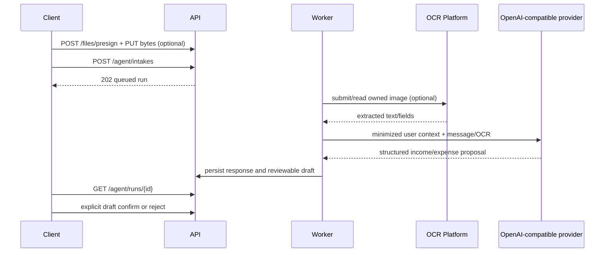

# Agent review-first

Luồng nhập giao dịch an toàn là upload ảnh tùy chọn → gửi message vào `/agent/intakes` → poll run → đọc draft → người dùng confirm/reject. Không bỏ qua bước review, kể cả khi OCR hoặc model trả độ tin cậy cao. Luồng `/agent/advisor/messages` là chat tư vấn read-only, không tạo nháp.

Chỉ gửi dữ liệu cần thiết: ví/danh mục liên quan và aggregate 30 ngày. Không đưa API key, cookie, raw provider error hoặc dữ liệu user khác vào prompt/log. Hiển thị `response_text` như text, không render HTML từ provider. Nếu cần hỏi phân tích tài chính, dùng `/agent/advisor/messages`; nếu cần thêm giao dịch text/ảnh, dùng `/agent/intakes`.

OCR là dependency bên thứ ba dành cho agent. MyPocket worker gọi `mac-ocr` bằng API key riêng, submit `input.base64`, poll theo `documentId`, rồi dùng `result.text`/`resultExpiresAt` làm context cho run hiện tại. Không xây workflow ngân hàng dựa trên OCR; không coi OCR fields là giao dịch đã xác nhận.
