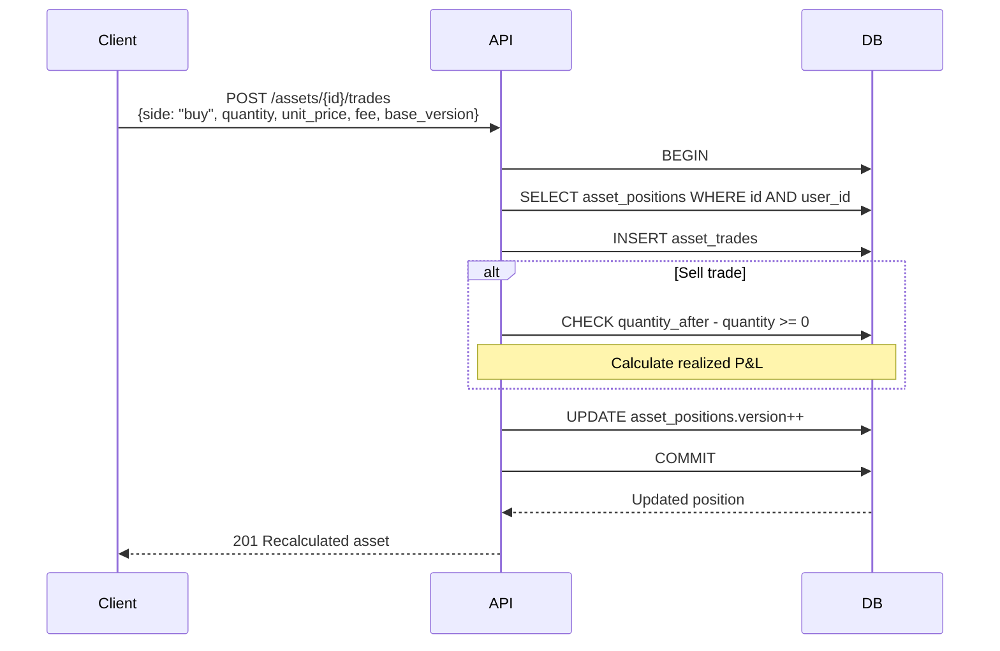

# Assets API

## OpenAPI Spec

```yaml
openapi: 3.0.0
paths:
  /api/v1/assets:
    get:
      summary: Danh sách tài sản (có valuation)
      security: [{ cookieAuth: [], bearerAuth: [] }]
      responses:
        "200":
          content:
            application/json:
              schema:
                type: object
                properties:
                  assets:
                    type: array
                    items: { $ref: "#/components/schemas/AssetPosition" }
    post:
      summary: Tạo tài sản
      security: [{ cookieAuth: [], csrf: [] }]
      requestBody:
        required: true
        content:
          application/json:
            schema: { $ref: "#/components/schemas/CreateAssetInput" }
      responses:
        "201": { description: "Created" }
  /api/v1/assets/{id}:
    get:
      summary: Chi tiết tài sản
      security: [{ cookieAuth: [], bearerAuth: [] }]
    post:
      path: /{id}/archive
      summary: Lưu trữ tài sản
      security: [{ cookieAuth: [], csrf: [] }]
      requestBody:
        required: true
        content:
          application/json:
            schema:
              type: object
              properties:
                base_version: { type: integer }
  /api/v1/assets/{id}/trades:
    post:
      summary: Thêm giao dịch mua/bán
      security: [{ cookieAuth: [], csrf: [] }]
      requestBody:
        required: true
        content:
          application/json:
            schema: { $ref: "#/components/schemas/AddTradeInput" }
      responses:
        "201": { description: "Recalculated asset" }
        "400": { description: "ASSET_OVERSELL" }
  /api/v1/assets/{id}/trades/{trade_id}:
    patch:
      summary: Sửa giao dịch
      security: [{ cookieAuth: [], csrf: [] }]
    post:
      path: /{trade_id}/archive
      summary: Xoá giao dịch
      security: [{ cookieAuth: [], csrf: [] }]
  /api/v1/assets/{id}/prices:
    post:
      summary: Thêm giá
      security: [{ cookieAuth: [], csrf: [] }]
      requestBody:
        required: true
        content:
          application/json:
            schema: { $ref: "#/components/schemas/AddPriceInput" }
      responses:
        "201": { description: "Recalculated asset" }
  /api/v1/portfolio/summary:
    get:
      summary: Tổng quan danh mục
      security: [{ cookieAuth: [], bearerAuth: [] }]
      responses:
        "200":
          content:
            application/json:
              schema: { $ref: "#/components/schemas/PortfolioSummary" }
components:
  schemas:
    AssetPosition:
      type: object
      properties:
        id: { type: string, format: uuid }
        type: { type: string, enum: ["gold", "stock", "crypto", "foreign_currency", "other"] }
        symbol: { type: string }
        exchange: { type: string }
        name: { type: string }
        unit: { type: string }
        reporting_currency: { type: string, default: "VND" }
        pricing_mode: { type: string, enum: ["manual", "automatic"] }
        include_in_net_worth: { type: boolean }
        version: { type: integer }
        summary:
          type: object
          properties:
            quantity: { type: string }
            cost_basis_vnd: { type: integer }
            realized_pnl_vnd: { type: integer }
            current_unit_price_vnd: { type: integer }
            market_value_vnd: { type: integer }
            unrealized_pnl_vnd: { type: integer }
            unrealized_pnl_percent: { type: string }
            valuation_status: { type: string, enum: ["current", "stale", "missing"] }
        latest_price:
          type: object
          properties:
            unit_price_vnd: { type: integer }
            priced_at: { type: string, format: date-time }
            source: { type: string }
    CreateAssetInput:
      type: object
      required: [type, name, unit]
      properties:
        type: { type: string, enum: ["gold", "stock", "crypto", "foreign_currency", "other"] }
        symbol: { type: string }
        exchange: { type: string }
        name: { type: string }
        unit: { type: string }
        pricing_mode: { type: string, default: "manual" }
        provider_key: { type: string }
        provider_symbol: { type: string }
        include_in_net_worth: { type: boolean, default: true }
    AddTradeInput:
      type: object
      required: [side, quantity, unit_price_vnd, occurred_at, base_version]
      properties:
        side: { type: string, enum: ["buy", "sell"] }
        quantity: { type: string }
        unit_price_vnd: { type: integer }
        fee_vnd: { type: integer, default: 0 }
        occurred_at: { type: string, format: date-time }
        note: { type: string }
        base_version: { type: integer }
    AddPriceInput:
      type: object
      required: [unit_price_vnd, priced_at, source, base_version]
      properties:
        unit_price_vnd: { type: integer, minimum: 1 }
        priced_at: { type: string, format: date-time }
        source: { type: string }
        base_version: { type: integer }
    PortfolioSummary:
      type: object
      properties:
        investment_market_value_vnd: { type: integer }
        missing_price_count: { type: integer }
        position_count: { type: integer }
```

## Asset types

| type | Unit (default) | Example |
|------|---------------|---------|
| `gold` | tael | SJC 9999 |
| `stock` | share | FPT on HOSE |
| `crypto` | token | BTC |
| `foreign_currency` | unit | USD |
| `other` | unit | Collectibles |

## Pricing modes

| Mode | Mô tả |
|------|-------|
| `manual` | User tự nhập giá qua `POST /prices` |
| `automatic` | Provider fetch (worker) — cần provider_key + provider_symbol |

## Valuation calculation

```
current_unit_price_vnd = latest price from asset_price_history
market_value_vnd = quantity * current_unit_price_vnd
cost_basis_vnd = moving average (quantity_after * avg_price)
unrealized_pnl_vnd = market_value_vnd - cost_basis_vnd
realized_pnl_vnd = từ các sell trades (FIFO-based)
```

## Sequence diagram — Buy trade

