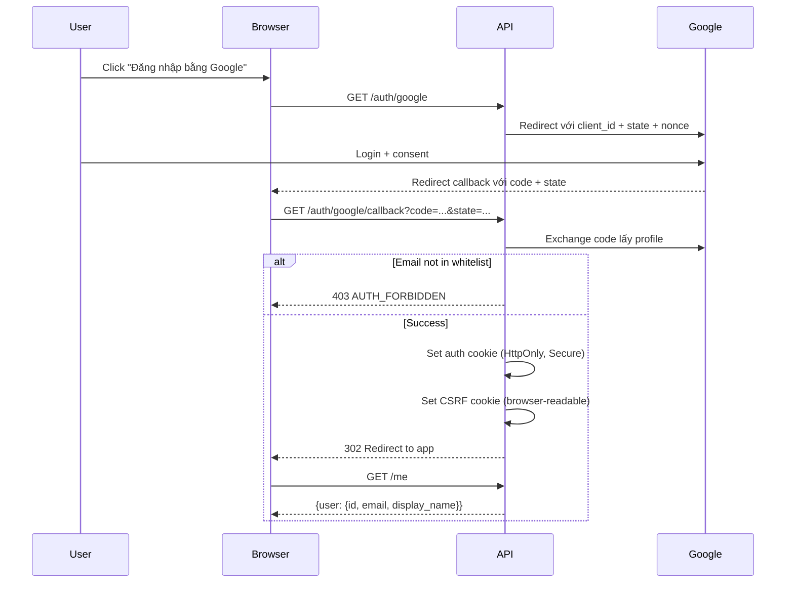
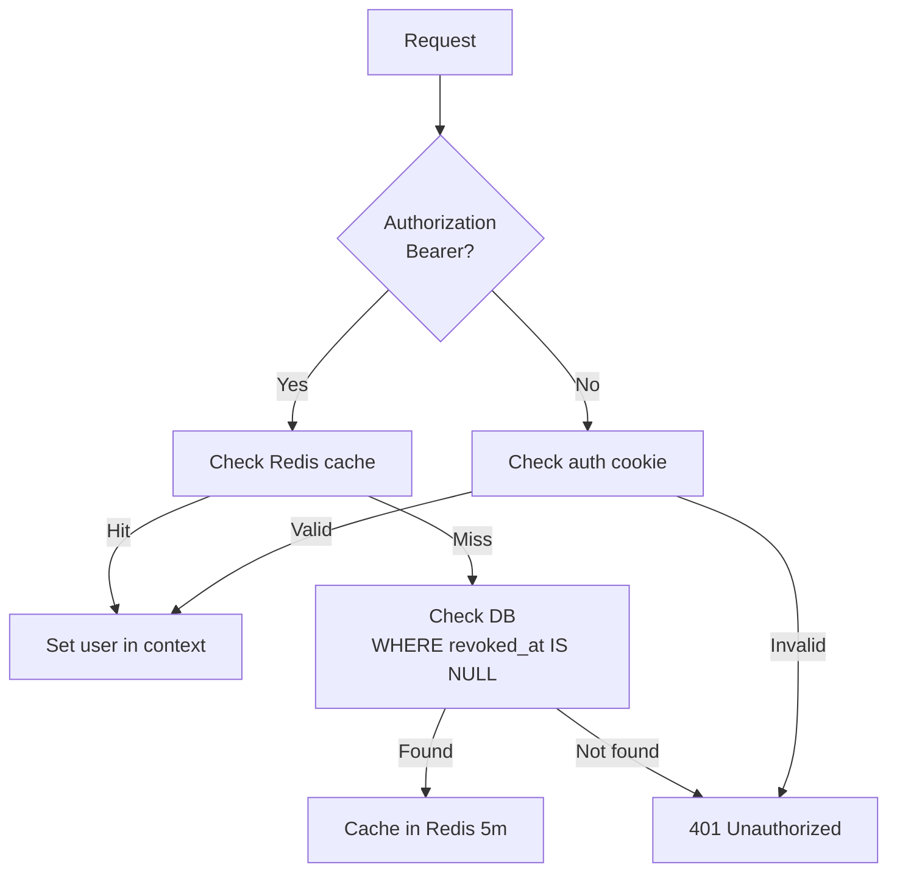

# Authentication

## Google OAuth Flow



### Fixture mode (dev)

Khi `OAUTH_FIXTURE_MODE=true`, callback không cần Google thật — dùng cho test và development.

## API Keys

### Create key

```http
POST /api/v1/api-keys
X-CSRF-Token: ...
```

```json
// Request
{ "name": "AI Agent" }
```

```json
// Response 201
{
  "key": {
    "id": "uuid",
    "name": "AI Agent",
    "key_prefix": "mpk_a1b2c3d4",
    "plaintext": "mpk_a1b2c3d4e5f6...",
    "created_at": "..."
  }
}
```

`plaintext` chỉ trả về 1 lần duy nhất. Key dạng `mpk_...` + 40 ký tự hex.

### List keys

```http
GET /api/v1/api-keys
```

```json
{
  "keys": [
    {
      "id": "uuid",
      "name": "AI Agent",
      "key_prefix": "mpk_a1b2c3d4",
      "last_used_at": "...",
      "revoked_at": null,
      "created_at": "..."
    }
  ]
}
```

### Revoke key

```http
POST /api/v1/api-keys/{id}/revoke
X-CSRF-Token: ...
```

- Cập nhật `revoked_at` trong DB
- Xoá cache Redis
- Key cũ không còn dùng được

### Call API với key

```bash
curl -H "Authorization: Bearer mpk_a1b2c3d4e5f6..." \
  http://localhost:8080/api/v1/me
```

Cache: Redis TTL 5 phút. Fallback DB khi cache miss.

## CSRF Protection

- Cookie: `mypocket_csrf` (browser-readable, SameSite=Lax)
- Header: `X-CSRF-Token` phải match cookie value
- Áp dụng cho mọi mutation (POST/PATCH/PUT/DELETE)
- GET requests không cần CSRF

## Logout

```http
POST /api/v1/auth/logout
X-CSRF-Token: ...
```

Xoá auth cookie + CSRF cookie. IndexedDB cũng được clear ở client.

## Auth middleware

