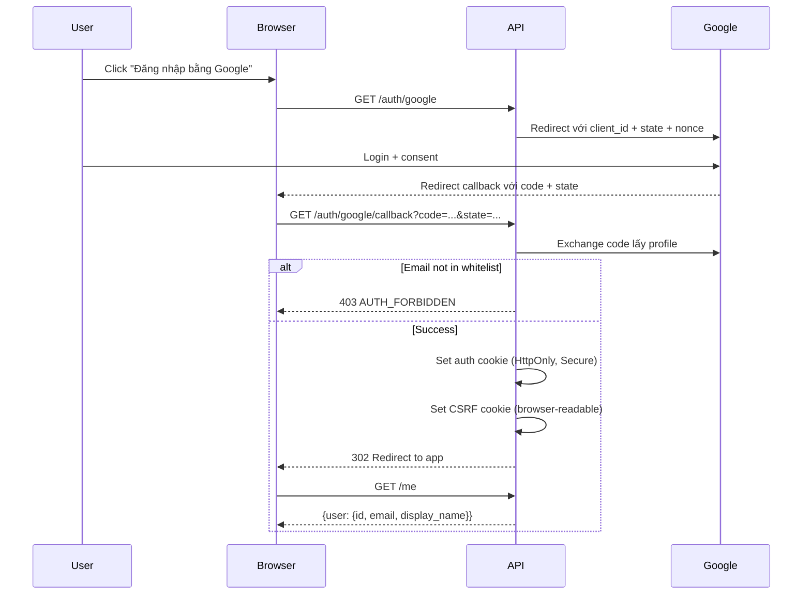
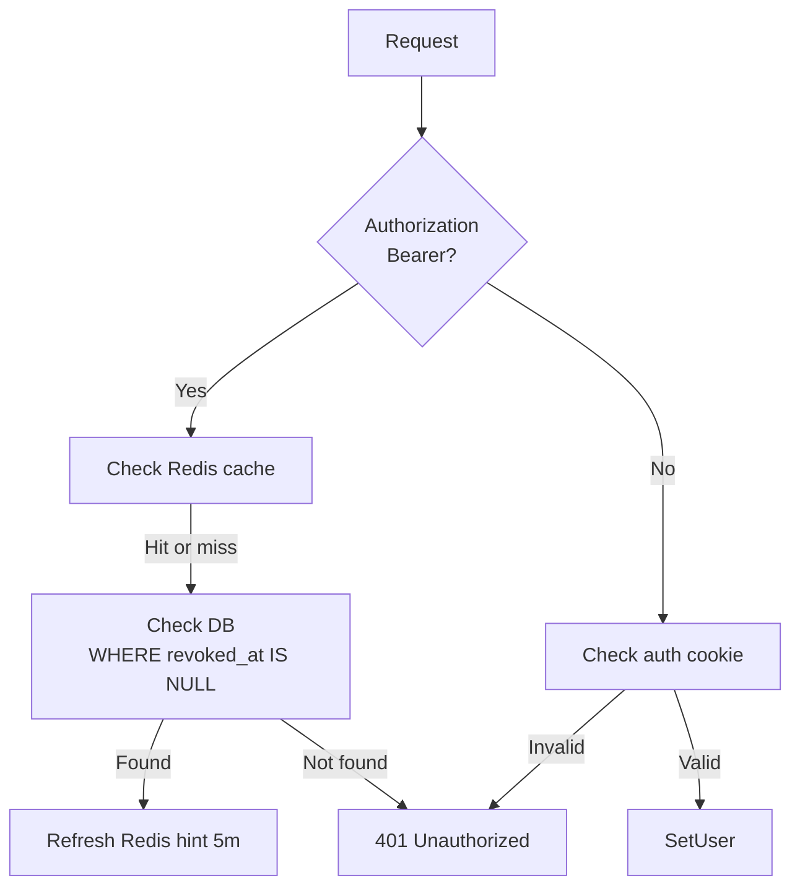

# Authentication

## Google OAuth Flow



### Fixture mode (dev)

Khi `OAUTH_FIXTURE_MODE=true`, callback không cần Google thật — dùng cho test và development.

## API Keys

### Create key

```http
POST /api/v1/api-keys
X-CSRF-Token: ...
```

```json
// Request
{ "name": "AI Agent" }
```

```json
// Response 201
{
  "key": {
    "id": "uuid",
    "name": "AI Agent",
    "key_prefix": "mpk_a1b2c3d4",
    "plaintext": "mpk_a1b2c3d4e5f6...",
    "created_at": "..."
  }
}
```

`plaintext` chỉ trả về 1 lần duy nhất. Key dạng `mpk_...` + 40 ký tự hex.

### List keys

```http
GET /api/v1/api-keys
```

```json
{
  "keys": [
    {
      "id": "uuid",
      "name": "AI Agent",
      "key_prefix": "mpk_a1b2c3d4",
      "last_used_at": "...",
      "revoked_at": null,
      "created_at": "..."
    }
  ]
}
```

### Revoke key

```http
POST /api/v1/api-keys/{id}/revoke
X-CSRF-Token: ...
```

- Cập nhật `revoked_at` trong DB
- Xoá cache Redis
- Key cũ không còn dùng được

### Quy tắc phân quyền cho API key

- API key chỉ ánh xạ đúng 1 chủ sở hữu user duy nhất.
- Key không thể truyền quyền người dùng theo `user_id` trong payload; backend luôn lấy `user_id` từ context auth.
- Mọi endpoint nghiệp vụ user-owned đều áp dụng cùng logic quyền sở hữu với cookie.

### Call API với key

```bash
curl -H "Authorization: Bearer mpk_a1b2c3d4e5f6..." \
  https://money.dungxbuif.com/api/v1/me
```

Redis giữ hint ánh xạ trong TTL 5 phút, nhưng PostgreSQL vẫn xác nhận key còn active trên mỗi Bearer request. Vì vậy entry Redis cũ hoặc lỗi xoá cache không thể giữ quyền của key đã revoke.

Bearer key có toàn quyền với dữ liệu thuộc chính chủ key trên các API nghiệp vụ (`wallets`, `categories`, `transactions`, planning, reports, assets, files và sync). Không gửi `X-CSRF-Token` khi gọi bằng key.
OAuth, health endpoint và tạo/thu hồi API key không chấp nhận bearer key.

Audit API (`/api/v1/audit/access`, `/api/v1/audit/events`) không cho phép truy cập bằng API key; chỉ session cookie đã xác thực và email đúng `AUDIT_VIEWER_EMAIL`.

## CSRF Protection

- Cookie: `mypocket_csrf` (browser-readable, SameSite=Lax)
- Header: `X-CSRF-Token` phải match cookie value
- Áp dụng cho mutation dùng cookie (POST/PATCH/PUT/DELETE); bearer API key không cần CSRF
- GET requests không cần CSRF

## Redis cache & phân quyền audit

- Redis là cache/hint xác thực: lưu tạm API-key hash hoặc token cookie hash. Với API key, PostgreSQL vẫn là authority trên từng request; cache không tự cấp quyền.
- Bất kỳ cache miss/timeout đều tiếp tục qua PostgreSQL — không mất phân quyền chỉ vì Redis lỗi.
- Nếu request đã gửi `Authorization`, key sai/revoked trả `401`; server không fallback sang cookie đi kèm.
- Mỗi hành động mutation/đăng nhập thất bại có audit event nếu có repository khả dụng.
- Audit read API vẫn áp dụng kiểm tra riêng theo email `AUDIT_VIEWER_EMAIL` sau khi auth cookie hợp lệ.

## Logout

```http
POST /api/v1/auth/logout
X-CSRF-Token: ...
```

Xoá auth cookie + CSRF cookie. Client xoá cache dữ liệu người dùng trong localStorage và bỏ tài khoản đang hoạt động. IndexedDB được tách theo người dùng; dữ liệu đang chờ đồng bộ được giữ lại cho chủ sở hữu, không được chuyển sang tài khoản đăng nhập tiếp theo. Đăng xuất không phải thao tác xoá toàn bộ dữ liệu offline.

## Auth middleware


