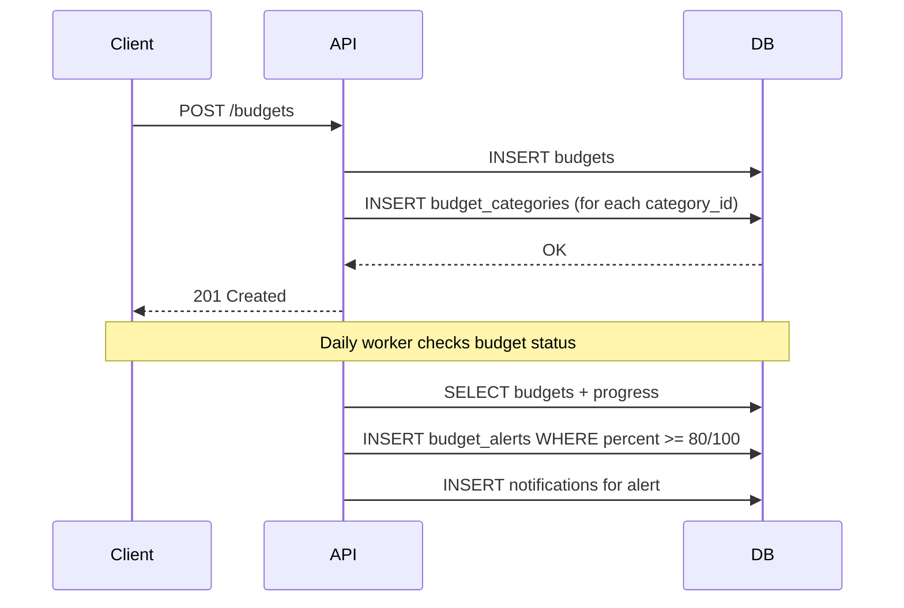

# Budgets API

## OpenAPI Spec

```yaml
openapi: 3.0.0
paths:
  /api/v1/budgets:
    get:
      summary: Danh sách ngân sách (có progress)
      security: [{ cookieAuth: [], bearerAuth: [] }]
      responses:
        "200":
          content:
            application/json:
              schema:
                type: object
                properties:
                  budgets:
                    type: array
                    items:
                      type: object
                      properties:
                        budget: { $ref: "#/components/schemas/Budget" }
                        period_start: { type: string, format: date }
                        period_end: { type: string, format: date }
                        spent_vnd: { type: integer }
                        remaining_vnd: { type: integer }
                        percent: { type: integer }
                        alert_80: { type: boolean }
                        alert_100: { type: boolean }
    post:
      summary: Tạo ngân sách
      security: [{ cookieAuth: [], csrf: [] }, { bearerAuth: [] }]
      requestBody:
        required: true
        content:
          application/json:
            schema: { $ref: "#/components/schemas/CreateBudgetInput" }
      responses:
        "201": { description: "Created" }
  /api/v1/budgets/{id}:
    patch:
      summary: Sửa ngân sách với optimistic concurrency
      security: [{ cookieAuth: [], csrf: [] }, { bearerAuth: [] }]
      requestBody:
        required: true
        content:
          application/json:
            schema: { $ref: "#/components/schemas/UpdateBudgetInput" }
      responses:
        "200": { description: "OK" }
        "409": { description: "VERSION_CONFLICT" }
  /api/v1/budgets/{id}/archive:
    post:
      summary: Lưu trữ ngân sách
      security: [{ cookieAuth: [], csrf: [] }, { bearerAuth: [] }]
      requestBody:
        required: true
        content:
          application/json:
            schema:
              type: object
              required: [base_version]
              properties:
                base_version: { type: integer, minimum: 1 }
      responses:
        "200": { description: "OK" }
        "409": { description: "VERSION_CONFLICT" }
components:
  schemas:
    Budget:
      type: object
      properties:
        id: { type: string, format: uuid }
        name: { type: string }
        period_type: { type: string, enum: ["weekly", "monthly", "quarterly", "yearly", "custom"] }
        amount_vnd: { type: integer }
        category_ids: { type: array, items: { type: string, format: uuid } }
        all_categories: { type: boolean }
        version: { type: integer }
    CreateBudgetInput:
      type: object
      required: [name, period_type, amount_vnd]
      properties:
        name: { type: string }
        period_type: { type: string, enum: ["weekly", "monthly", "quarterly", "yearly", "custom"] }
        amount_vnd: { type: integer, minimum: 1 }
        category_ids: { type: array, items: { type: string, format: uuid } }
        custom_start: { type: string, format: date }
        custom_end: { type: string, format: date }
    UpdateBudgetInput:
      allOf:
        - { $ref: "#/components/schemas/CreateBudgetInput" }
        - type: object
          required: [base_version]
          properties:
            base_version: { type: integer, minimum: 1 }
```

## Period types

| type | Ý nghĩa | Ghi chú |
|------|---------|---------|
| `weekly` | Hàng tuần | |
| `monthly` | Hàng tháng | |
| `quarterly` | Hàng quý | |
| `yearly` | Hàng năm | |
| `custom` | Tuỳ chỉnh | Yêu cầu custom_start + custom_end |

## Budget alerts

- 80%: `alert_80 = true`, ghi 1 dòng vào `budget_alerts`
- 100%: `alert_100 = true`, ghi 1 dòng vào `budget_alerts`
- Dedupe: `UNIQUE (budget_id, threshold, period_start)`

## Progress calculation

Progress được tính theo múi giờ `Asia/Ho_Chi_Minh`:

```
spent_vnd = SUM(transactions.amount_vnd) WHERE category IN budget_categories
             AND occurred_at BETWEEN period_start AND period_end
             AND excluded_from_reports = false
remaining_vnd = amount_vnd - spent_vnd
percent = (spent_vnd * 100) / amount_vnd
```

Phép tính phần trăm dùng số nguyên lớn nội bộ và bão hòa ở `MaxInt64`, không được wrap khi dữ liệu cực trị. Update/archive bắt buộc gửi `base_version` lấy từ `budget.version`; version cũ trả `409 VERSION_CONFLICT` và không ghi đè dữ liệu mới hơn.

## Sequence diagram


