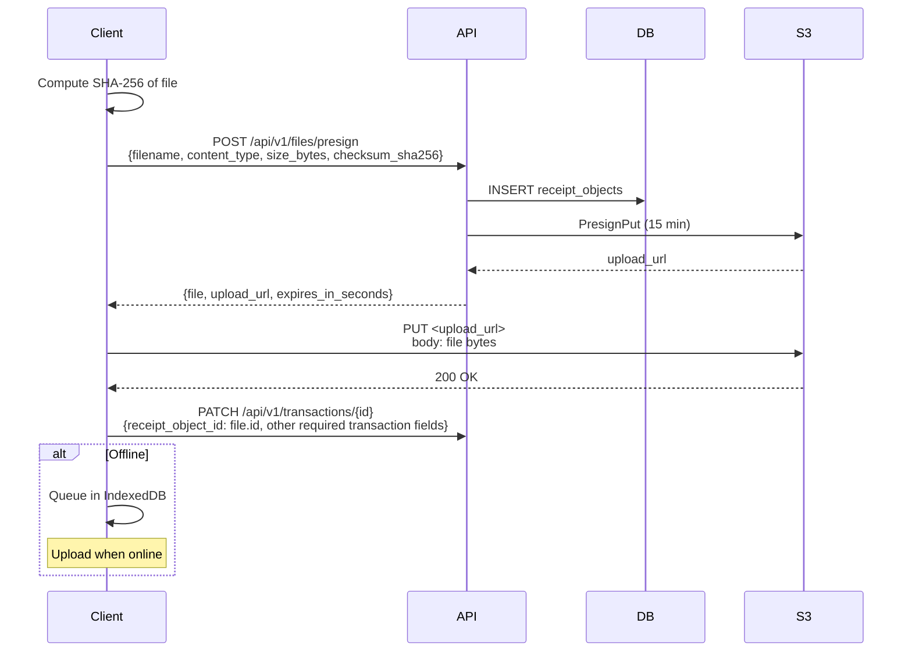

# Export API

> Cập nhật 2026-09-11: export/import và account lifecycle đã triển khai bằng job versioned. OpenAPI live là contract chính thức; khối dưới chỉ minh họa.

## Authentication

- `POST /files/presign` là mutation nên dùng cookie + `X-CSRF-Token` hoặc Bearer API key.
- `GET /files/{id}/download`, `GET /exports`, `GET /exports/{id}` là read endpoint: dùng cookie hoặc Bearer API key.
- Quy tắc sở hữu: chỉ file/đối tượng thuộc `user_id` trong context.

```yaml
openapi: 3.0.0
paths:
  /api/v1/exports:
    post:
      summary: Tạo export job
      security: [{ cookieAuth: [], csrf: [] }, { bearerAuth: [] }]
      requestBody:
        required: true
        content:
          application/json:
            schema:
              type: object
              properties:
                format: { type: string, enum: ["csv"] }
                wallet_id: { type: string, format: uuid }
                date_from: { type: string, format: date }
                date_to: { type: string, format: date }
      responses:
        "202": { description: "Accepted" }
  /api/v1/exports/{id}:
    get:
      summary: Chi tiết export
      security: [{ cookieAuth: [], bearerAuth: [] }]
  /api/v1/exports/{id}/download:
    get:
      summary: Lấy URL CSV riêng tư, thời hạn ngắn
      security: [{ cookieAuth: [], bearerAuth: [] }]
```

## Receipts (Upload/Download)

```yaml
paths:
  /api/v1/files/presign:
    post:
      summary: Chuẩn bị upload receipt — trả về presigned URL
      security: [{ cookieAuth: [], csrf: [] }, { bearerAuth: [] }]
      requestBody:
        required: true
        content:
          application/json:
            schema:
              type: object
              required: [filename, content_type, size_bytes, checksum_sha256]
              properties:
                filename: { type: string }
                content_type: { type: string, enum: ["image/jpeg", "image/png", "image/webp"] }
                size_bytes: { type: integer, maximum: 15728640 }
                checksum_sha256: { type: string }
      responses:
        "201":
          content:
            application/json:
              schema:
                type: object
                properties:
                  file: { $ref: "#/components/schemas/ReceiptObject" }
                  upload_url: { type: string }
                  expires_in_seconds: { type: integer }
  /api/v1/files/{id}/download:
    get:
      summary: Lấy download URL
      security: [{ cookieAuth: [], bearerAuth: [] }]
      responses:
        "200":
          content:
            application/json:
              schema:
                type: object
                properties:
                  file: { $ref: "#/components/schemas/ReceiptObject" }
                  download_url: { type: string }
                  expires_in_seconds: { type: integer }
components:
  schemas:
    ReceiptObject:
      type: object
      properties:
        id: { type: string, format: uuid }
        object_key: { type: string }
        content_type: { type: string }
        size_bytes: { type: integer }
        original_filename: { type: string }
        created_at: { type: string, format: date-time }
```

## Receipt upload flow



## Upload constraints

Các file response còn có `status` và `correlation_id`. Upload URL hết hạn sau 900 giây, download URL sau 600 giây. Browser cookie mutation cần CSRF; bearer API key dùng được và không cần CSRF. Presign kiểm tra metadata; không suy ra đã có OCR hoặc đã xác minh toàn bộ nội dung file upload.

| Field | Giới hạn |
|-------|---------|
| `content_type` | `image/jpeg`, `image/png`, `image/webp` |
| `size_bytes` | Max 15MB |
| `filename` | Base name, no path traversal |
| `checksum_sha256` | 64 hex characters |
