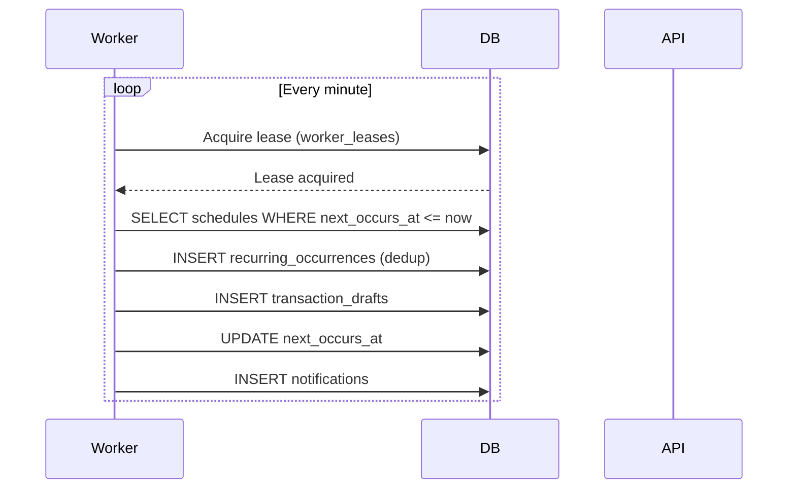

# Planning API

## Events

```yaml
paths:
  /api/v1/events:
    get:
      summary: Danh sách sự kiện
      security: [{ cookieAuth: [], bearerAuth: [] }]
      responses:
        "200":
          content:
            application/json:
              schema:
                type: object
                properties:
                  events:
                    type: array
                    items: { $ref: "#/components/schemas/Event" }
    post:
      summary: Tạo sự kiện
      security: [{ cookieAuth: [], csrf: [] }]
      requestBody:
        required: true
        content:
          application/json:
            schema: { $ref: "#/components/schemas/CreateEventInput" }
      responses:
        "201": { description: "Created" }
  /api/v1/events/{id}:
    patch:
      summary: Sửa sự kiện
      security: [{ cookieAuth: [], csrf: [] }]
    post:
      path: /{id}/archive
      summary: Lưu trữ sự kiện
      security: [{ cookieAuth: [], csrf: [] }]
  /api/v1/events/{id}/transactions/{transaction_id}:
    post:
      summary: Gắn giao dịch vào sự kiện
      security: [{ cookieAuth: [], csrf: [] }]
components:
  schemas:
    Event:
      type: object
      properties:
        id: { type: string, format: uuid }
        name: { type: string }
        starts_on: { type: string, format: date }
        ends_on: { type: string, format: date }
        note: { type: string }
        total_vnd: { type: integer }
        transaction_count: { type: integer }
        version: { type: integer }
    CreateEventInput:
      type: object
      required: [name, starts_on, ends_on]
      properties:
        name: { type: string }
        starts_on: { type: string, format: date }
        ends_on: { type: string, format: date }
        note: { type: string }
```

- `total_vnd` = tổng các giao dịch đã link (không tính `excluded_from_reports`)
- `transaction_count` = số giao dịch đã link

## Obligations (Khoản vay nợ)

```yaml
paths:
  /api/v1/obligations:
    get:
      summary: Danh sách khoản vay nợ
      security: [{ cookieAuth: [], bearerAuth: [] }]
    post:
      summary: Tạo khoản nợ
      security: [{ cookieAuth: [], csrf: [] }]
      requestBody:
        required: true
        content:
          application/json:
            schema: { $ref: "#/components/schemas/CreateObligationInput" }
      responses:
        "201": { description: "Created" }
  /api/v1/obligations/{id}/repayments/{transaction_id}:
    post:
      summary: Gắn giao dịch trả nợ
      security: [{ cookieAuth: [], csrf: [] }]
      responses:
        "200": { description: "OK" }
        "400": { description: "Over principal" }
components:
  schemas:
    Obligation:
      type: object
      properties:
        id: { type: string, format: uuid }
        direction: { type: string, enum: ["borrowed", "lent"] }
        principal_vnd: { type: integer }
        counterparty: { type: string }
        due_on: { type: string, format: date }
        note: { type: string }
        repaid_vnd: { type: integer }
        remaining_vnd: { type: integer }
        version: { type: integer }
    CreateObligationInput:
      type: object
      required: [direction, principal_vnd, counterparty, due_on]
      properties:
        direction: { type: string, enum: ["borrowed", "lent"] }
        principal_vnd: { type: integer, minimum: 1 }
        counterparty: { type: string }
        due_on: { type: string, format: date }
        note: { type: string }
```

- `repaid_vnd` = tổng các repayment transactions
- `remaining_vnd` = `principal_vnd - repaid_vnd`
- Overpayment protection: trả về `VALIDATION_FAILED` nếu vượt quá principal

## Recurring Schedules (Lịch lặp)

```yaml
paths:
  /api/v1/recurring-schedules:
    get:
      summary: Danh sách lịch lặp
      security: [{ cookieAuth: [], bearerAuth: [] }]
    post:
      summary: Tạo lịch lặp
      security: [{ cookieAuth: [], csrf: [] }]
      requestBody:
        required: true
        content:
          application/json:
            schema: { $ref: "#/components/schemas/CreateScheduleInput" }
      responses:
        "201": { description: "Created" }
  /api/v1/recurring-schedules/{id}/archive:
    post:
      summary: Lưu trữ lịch lặp
      security: [{ cookieAuth: [], csrf: [] }]
components:
  schemas:
    RecurringSchedule:
      type: object
      properties:
        id: { type: string, format: uuid }
        name: { type: string }
        frequency: { type: string, enum: ["daily", "weekly", "monthly"] }
        timezone: { type: string }
        starts_at: { type: string, format: date-time }
        next_occurs_at: { type: string, format: date-time }
        type: { type: string, enum: ["income", "expense", "transfer"] }
        source_wallet_id: { type: string, format: uuid }
        destination_wallet_id: { type: string, format: uuid }
        category_id: { type: string, format: uuid }
        amount_vnd: { type: integer }
        note: { type: string }
        version: { type: integer }
    CreateScheduleInput:
      type: object
      required: [name, frequency, timezone, starts_at, type, source_wallet_id, amount_vnd]
      properties:
        name: { type: string }
        frequency: { type: string, enum: ["daily", "weekly", "monthly"] }
        timezone: { type: string, default: "Asia/Ho_Chi_Minh" }
        starts_at: { type: string, format: date-time }
        type: { type: string, enum: ["income", "expense", "transfer"] }
        source_wallet_id: { type: string, format: uuid }
        destination_wallet_id: { type: string, format: uuid }
        category_id: { type: string, format: uuid }
        amount_vnd: { type: integer, minimum: 1 }
        note: { type: string }
```

## Transaction Drafts (Bản nháp)

```yaml
paths:
  /api/v1/transaction-drafts:
    get:
      summary: Danh sách bản nháp
      security: [{ cookieAuth: [], bearerAuth: [] }]
components:
  schemas:
    TransactionDraft:
      type: object
      properties:
        id: { type: string, format: uuid }
        schedule_id: { type: string, format: uuid }
        occurrence_key: { type: string }
        type: { type: string }
        source_wallet_id: { type: string, format: uuid }
        category_id: { type: string, format: uuid }
        amount_vnd: { type: integer }
        occurred_at: { type: string, format: date-time }
        note: { type: string }
        status: { type: string, enum: ["pending", "confirmed", "rejected"] }
        version: { type: integer }
```

- Drafts do worker sinh ra từ recurring schedules
- `status = "pending"` — chưa được xác nhận
- `confirmed_transaction_id` nullable — khi được confirm
- Không ảnh hưởng balance

## Sequence diagram — Recurring schedule worker

