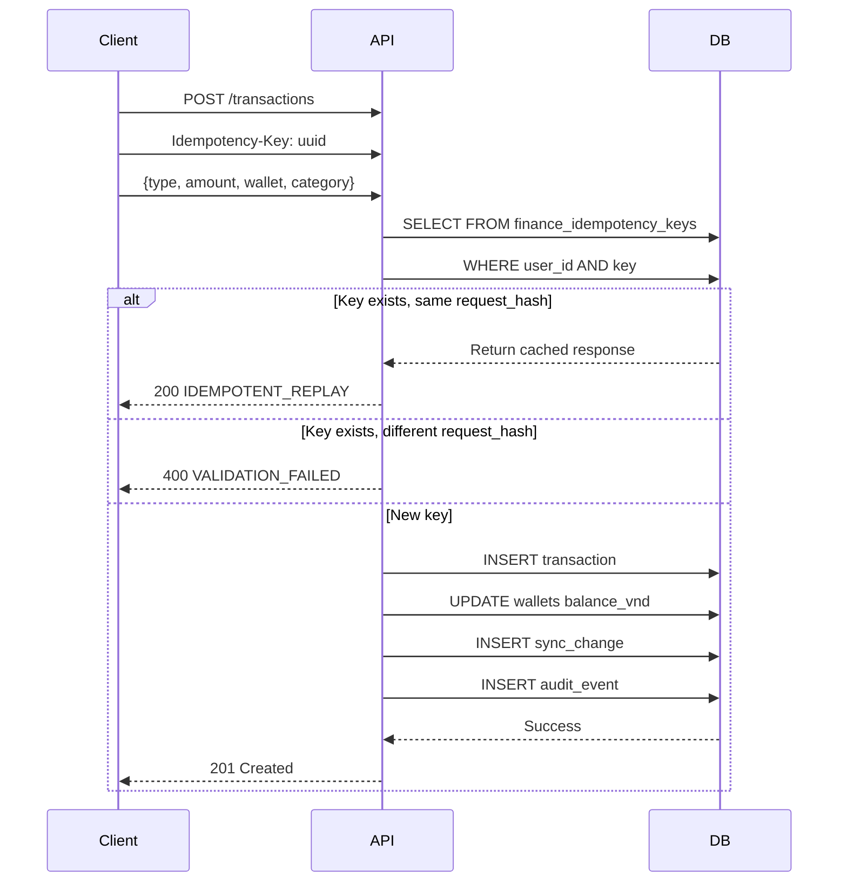

# Transactions API

## OpenAPI Spec

```yaml
openapi: 3.0.0
paths:
  /api/v1/transactions:
    get:
      summary: Danh sách giao dịch
      security:
        - cookieAuth: []
        - bearerAuth: []
      parameters:
        - name: wallet_id
          in: query
          schema:
            type: string
            format: uuid
        - name: category_id
          in: query
          schema:
            type: string
            format: uuid
        - name: type
          in: query
          schema:
            type: string
            enum: [income, expense, transfer, adjustment]
        - name: date_from
          in: query
          schema:
            type: string
            format: date-time
        - name: date_to
          in: query
          schema:
            type: string
            format: date-time
        - name: q
          in: query
          schema:
            type: string
          description: Search note, with_person, event_ref
        - name: excluded_from_reports
          in: query
          schema:
            type: boolean
        - name: include_archived
          in: query
          schema:
            type: boolean
            default: false
      responses:
        "200":
          content:
            application/json:
              schema:
                type: object
                properties:
                  transactions:
                    type: array
                    items:
                      $ref: "#/components/schemas/Transaction"
    post:
      summary: Tạo giao dịch
      security:
        - cookieAuth: []
        - csrf: []
      parameters:
        - name: Idempotency-Key
          in: header
          required: true
          schema:
            type: string
            format: uuid
      requestBody:
        required: true
        content:
          application/json:
            schema:
              $ref: "#/components/schemas/CreateTransactionInput"
      responses:
        "201":
          description: Created
        "200":
          description: Replayed (idempotent)
```

## Transaction type rules

| type | Effect | dest_wallet | category | target_balance |
|------|--------|-------------|----------|----------------|
| `income` | +balance | null | required | null |
| `expense` | -balance | null | required | null |
| `transfer` | -source, +dest | required | null | null |
| `adjustment` | set balance | null | null | required |

## Sequence diagram — Create transaction



## Search

```http
GET /api/v1/search?q=keyword
```

Tìm kiếm trong notes, with_person, event_ref của transactions và tên wallets. Cross-entity search.

## Errors

| Code | HTTP | Điều kiện |
|------|------|-----------|
| `VALIDATION_FAILED` | 400 | Type không hợp lệ, amount &lt;= 0, thiếu field |
| `NOT_FOUND` | 404 | Wallet/category không tồn tại |
| `VERSION_CONFLICT` | 409 | base_version cũ |
| `IDEMPOTENT_REPLAY` | 200 | Mutation đã được xử lý |