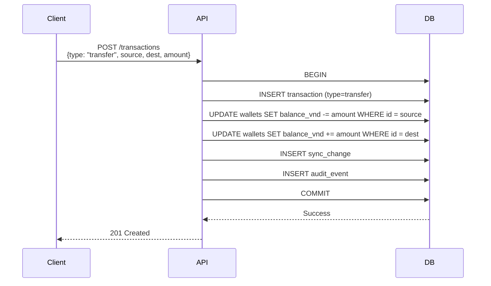

# Wallets API

## OpenAPI Spec

```yaml
openapi: 3.0.0
info:
  title: MyPocket Wallets API
  version: v1
paths:
  /api/v1/wallets:
    get:
      summary: Danh sách ví
      security: [{ cookieAuth: [], bearerAuth: [] }]
      responses:
        "200":
          description: Danh sách ví
          content:
            application/json:
              schema:
                type: object
                properties:
                  wallets:
                    type: array
                    items: { $ref: "#/components/schemas/Wallet" }
    post:
      summary: Tạo ví mới
      security: [{ cookieAuth: [], csrf: [] }]
      requestBody:
        required: true
        content:
          application/json:
            schema: { $ref: "#/components/schemas/CreateWalletInput" }
      responses:
        "201": { description: "Created" }
  /api/v1/wallets/{id}:
    patch:
      summary: Cập nhật ví
      security: [{ cookieAuth: [], csrf: [] }]
      parameters:
        - name: id
          in: path
          required: true
          schema: { type: string, format: uuid }
      requestBody:
        content:
          application/json:
            schema: { $ref: "#/components/schemas/UpdateWalletInput" }
      responses:
        "200": { description: "OK" }
  /api/v1/wallets/{id}/archive:
    post:
      summary: Lưu trữ ví
      security: [{ cookieAuth: [], csrf: [] }]
      responses:
        "200": { description: "OK" }
  /api/v1/wallets/{id}/default-ai:
    post:
      summary: Set ví mặc định cho AI
      security: [{ cookieAuth: [], csrf: [] }]
      responses:
        "200": { description: "OK" }
components:
  schemas:
    Wallet:
      type: object
      properties:
        id: { type: string, format: uuid }
        name: { type: string, example: "Tiền mặt" }
        type: { type: string, enum: ["cash", "bank", "credit", "e_wallet", "savings", "debt"] }
        balance_vnd: { type: integer, example: 120000 }
        include_in_total: { type: boolean }
        is_default_ai: { type: boolean }
        version: { type: integer }
    CreateWalletInput:
      type: object
      required: [name, type]
      properties:
        name: { type: string, minLength: 1 }
        type: { type: string, enum: ["cash", "bank", "credit", "e_wallet", "savings", "debt"] }
        credit_limit_vnd: { type: integer, nullable: true }
        statement_day: { type: integer, nullable: true, minimum: 1, maximum: 31 }
        payment_due_day: { type: integer, nullable: true, minimum: 1, maximum: 31 }
    UpdateWalletInput:
      type: object
      properties:
        name: { type: string }
        include_in_total: { type: boolean }
```

## Schema

### Wallet types

| type | Mô tả | Metadata |
|------|-------|----------|
| `cash` | Tiền mặt | — |
| `bank` | Tài khoản ngân hàng | — |
| `credit` | Thẻ tín dụng | credit_limit_vnd, statement_day, payment_due_day |
| `e_wallet` | Ví điện tử | — |
| `savings` | Tiết kiệm | — |
| `debt` | Nợ phải trả | — |

### Balance calculation

```
income  → balance_vnd += amount_vnd
expense → balance_vnd -= amount_vnd
transfer → source -= amount_vnd, dest += amount_vnd
adjustment → balance_vnd = target_balance_vnd
```

## Sequence diagram — Transfer



## Error codes

| Code | HTTP | Điều kiện |
|------|------|-----------|
| `AUTH_REQUIRED` | 401 | No cookie/Bearer |
| `VALIDATION_FAILED` | 400 | Name empty, type invalid |
| `NOT_FOUND` | 404 | Wallet ID không tồn tại |
| `VERSION_CONFLICT` | 409 | base_version stale |