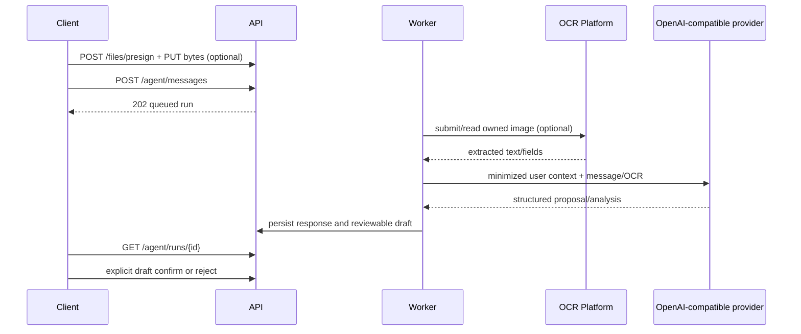

# Agent review-first

Luồng an toàn là upload ảnh tùy chọn → gửi message → poll run → đọc draft → người dùng confirm/reject. Không bỏ qua bước review, kể cả khi OCR hoặc model trả độ tin cậy cao.

Chỉ gửi dữ liệu cần thiết: ví/danh mục liên quan và aggregate 30 ngày. Không đưa API key, cookie, raw provider error hoặc dữ liệu user khác vào prompt/log. Hiển thị `response_text` như text, không render HTML từ provider.

OCR là dependency bên thứ ba dành cho agent. Không xây workflow ngân hàng dựa trên OCR; không coi OCR fields là giao dịch đã xác nhận.
