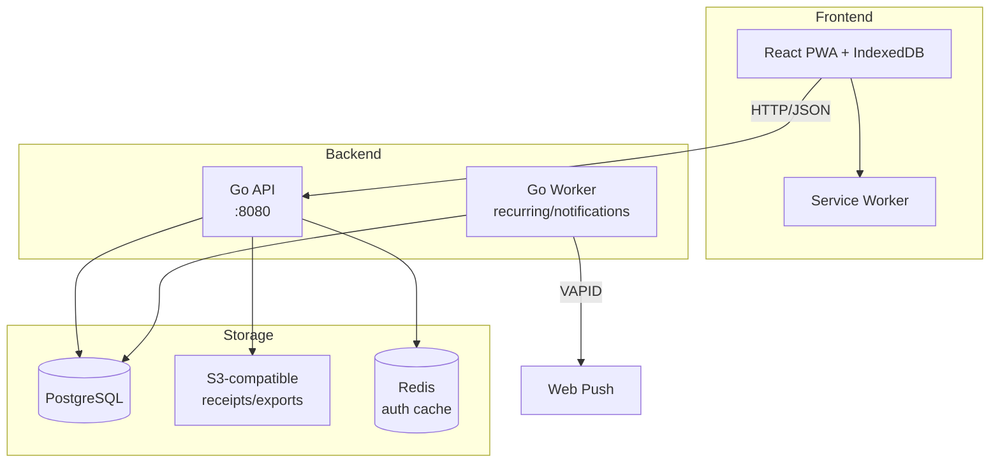

# MyPocket — Tài liệu kỹ thuật

**MyPocket** là ứng dụng quản lý tài chính cá nhân (PWA) dành cho homelab, với kiến trúc offline-first, đồng bộ real-time qua PostgreSQL.

## Kiến trúc tổng quan

## Công nghệ

| Layer | Công nghệ |
|-------|-----------|
| **Frontend** | React 19 + TypeScript + Vite 7 + Tailwind CSS v4 |
| **Backend** | Go 1.24 modular monolith (API + Worker) |
| **Database** | PostgreSQL 16 (source of truth) |
| **Object storage** | S3-compatible (presigned URLs) |
| **Cache** | Redis 7 (auth cache, API key lookup) |
| **Auth** | Google OAuth + stateless signed cookie + API keys |
| **Push** | Web Push (VAPID) via service worker |

## Tính năng đã implement

### Finance Core
- 6 loại ví: cash, bank, credit, e_wallet, savings, debt
- 4 loại giao dịch: income, expense, transfer, adjustment
- Danh mục 2 cấp: expense, income, debt — 6 system seeds
- Attachments: receipt upload/download via S3 presigned URL
- Idempotency: finance_idempotency_keys, request hashing
- Optimistic locking: version field trên mọi entity
- Search: transaction notes, wallets, categories

### Planning
- **Ngân sách**: weekly/monthly/quarterly/yearly/custom, 80%/100% alerts
- **Sự kiện**: date range, gắn transaction, tổng tự động
- **Khoản vay nợ**: borrowed/lent, principal, counterparty, repayment tracking
- **Lịch lặp**: daily/weekly/monthly, worker → draft → confirm
- **Bản nháp giao dịch**: pending/confirmed/rejected, không ảnh hưởng balance

### Offline Sync
- IndexedDB mirror: wallets, categories, transactions, assets
- Outbox queue: mutations khi offline, drain khi online
- Change feed: monotonic cursor, per-user
- Conflict resolution: keep-server, edit-and-retry, discard-local

### Analytics & Dashboard
- Dashboard: net worth, tổng thu/chi, investment summary
- Reports: cash-flow, categories, daily, comparison, cumulative, insider
- Money Insider: category frequency, daily average, 6-period chart, projection
- Wallet detail: balance, inflow/outflow, opening/ending balance
- Search: cross-entity search

### Portfolio
- 5 loại tài sản: gold, stock, crypto, foreign_currency, other
- Trades: mua/bán với moving-average cost basis
- Prices: append-only, manual hoặc provider
- Portfolio summary: market value, unrealized P&L
- Tách biệt hoàn toàn với wallet accounting

### Notifications
- Hộp thư in-app: cursor-bounded, read state
- Web Push: VAPID subscription lifecycle
- Worker: best-effort delivery, capped retry, expiry cleanup

### Operations
- API keys: tạo/revoke, HMAC hash, Redis cache
- Audit log: append-only, restricted to AUDIT_VIEWER_EMAIL
- Health: liveness + readiness, DB dependency check
- Export: CSV/Google Sheets (planned)

## API Surface (31 endpoints)

| Endpoint | Auth | Trạng thái |
|----------|------|-----------|
| `GET /auth/google` | Mixed | implemented |
| `GET /auth/google/callback` | Mixed | implemented |
| `POST /auth/logout` | Cookie+CSRF | implemented |
| `GET /me` | Cookie/Bearer | implemented |
| `GET /api-keys` | Cookie+CSRF | implemented |
| `POST /api-keys` | Cookie+CSRF | implemented |
| `POST /api-keys/{id}/revoke` | Cookie+CSRF | implemented |
| `GET /wallets` | Cookie/Bearer | implemented |
| `POST /wallets` | Cookie+CSRF | implemented |
| `PATCH /wallets/{id}` | Cookie+CSRF | implemented |
| `POST /wallets/{id}/archive` | Cookie+CSRF | implemented |
| `POST /wallets/{id}/default-ai` | Cookie+CSRF | implemented |
| `GET /categories` | Cookie/Bearer | implemented |
| `POST /categories` | Cookie+CSRF | implemented |
| `PATCH /categories/{id}` | Cookie+CSRF | implemented |
| `POST /categories/{id}/archive` | Cookie+CSRF | implemented |
| `PUT /wallets/{wallet_id}/categories/{category_id}` | Cookie+CSRF | implemented |
| `GET /transactions` | Cookie/Bearer | implemented |
| `POST /transactions` | Cookie+CSRF | implemented |
| `PATCH /transactions/{id}` | Cookie+CSRF | implemented |
| `POST /transactions/{id}/archive` | Cookie+CSRF | implemented |
| `GET /receipts/{id}` | Cookie/Bearer | implemented |
| `POST /receipts/uploads` | Cookie+CSRF | implemented |
| `GET /budgets` | Cookie/Bearer | implemented |
| `POST /budgets` | Cookie+CSRF | implemented |
| `PATCH /budgets/{id}` | Cookie+CSRF | implemented |
| `POST /budgets/{id}/archive` | Cookie+CSRF | implemented |
| `GET /events` | Cookie/Bearer | implemented |
| `POST /events` | Cookie+CSRF | implemented |
| `PATCH /events/{id}` | Cookie+CSRF | implemented |
| `POST /events/{id}/archive` | Cookie+CSRF | implemented |
| `POST /events/{id}/transactions/{transaction_id}` | Cookie+CSRF | implemented |
| `GET /obligations` | Cookie/Bearer | implemented |
| `POST /obligations` | Cookie+CSRF | implemented |
| `PATCH /obligations/{id}` | Cookie+CSRF | implemented |
| `POST /obligations/{id}/archive` | Cookie+CSRF | implemented |
| `POST /obligations/{id}/repayments/{transaction_id}` | Cookie+CSRF | implemented |
| `GET /recurring-schedules` | Cookie/Bearer | implemented |
| `POST /recurring-schedules` | Cookie+CSRF | implemented |
| `POST /recurring-schedules/{id}/archive` | Cookie+CSRF | implemented |
| `GET /transaction-drafts` | Cookie/Bearer | implemented |
| `GET /dashboard` | Cookie/Bearer | implemented |
| `GET /reports/{report}` | Cookie/Bearer | implemented |
| `GET /search` | Cookie/Bearer | implemented |
| `GET /assets` | Cookie/Bearer | implemented |
| `POST /assets` | Cookie+CSRF | implemented |
| `GET /assets/{id}` | Cookie/Bearer | implemented |
| `POST /assets/{id}/archive` | Cookie+CSRF | implemented |
| `POST /assets/{id}/trades` | Cookie+CSRF | implemented |
| `PATCH /assets/{id}/trades/{trade_id}` | Cookie+CSRF | implemented |
| `POST /assets/{id}/trades/{trade_id}/archive` | Cookie+CSRF | implemented |
| `POST /assets/{id}/prices` | Cookie+CSRF | implemented |
| `GET /portfolio/summary` | Cookie/Bearer | implemented |
| `GET /sync/mutations` | Cookie+CSRF | implemented |
| `GET /sync/changes` | Cookie/Bearer | implemented |
| `POST /sync/resync` | Cookie+CSRF | implemented |
| `GET /notifications` | Cookie/Bearer | implemented |
| `PATCH /notifications/{id}/read` | Cookie+CSRF | implemented |
| `POST /push-subscriptions` | Cookie+CSRF | implemented |
| `DELETE /push-subscriptions/{id}` | Cookie+CSRF | implemented |
| `GET /audit/events` | Cookie+Email | implemented |
| `GET /health/live` | None | implemented |
| `GET /health/ready` | None | implemented |

## Tài liệu tham khảo

- [Sơ đồ cơ sở dữ liệu (ERD)](/docs/erd/overview) — column-level schema, indexes, constraints
- [API endpoints](/docs/api/overview) — OpenAPI-style specs, request/response, sequence diagrams
- [Luồng xác thực](/docs/api/authentication) — OAuth, API keys, CSRF