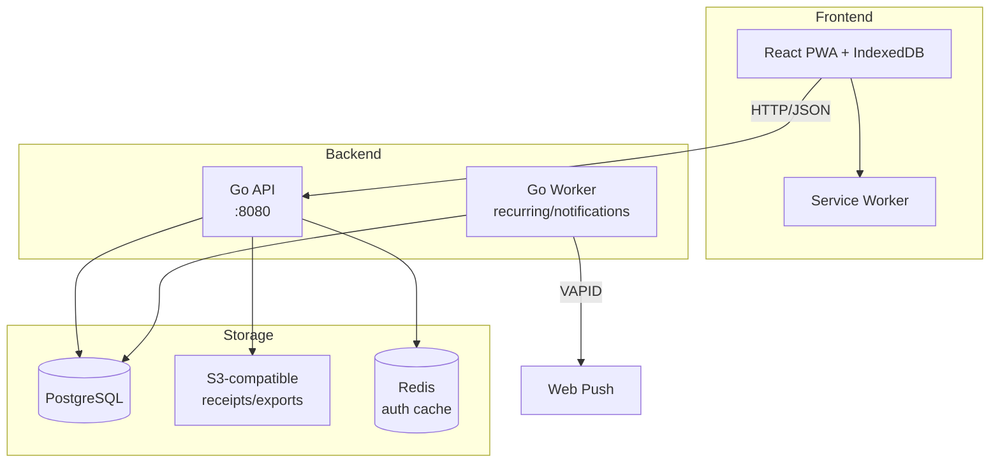

# MyPocket — Tài liệu kỹ thuật

**MyPocket** là ứng dụng quản lý tài chính cá nhân (PWA) dành cho homelab, với kiến trúc offline-first, đồng bộ real-time qua PostgreSQL.

## Kiến trúc tổng quan

## Công nghệ

| Layer | Công nghệ |
|-------|-----------|
| **Frontend** | React 19 + TypeScript + Vite 7 + Tailwind CSS v4 |
| **Backend** | Go 1.24 modular monolith (API + Worker) |
| **Database** | PostgreSQL 16 (source of truth) |
| **Object storage** | S3-compatible (presigned URLs) |
| **Cache** | Redis 7 (auth cache, API key lookup) |
| **Auth** | Google OAuth + stateless signed cookie + API keys |
| **Push** | Web Push (VAPID) via service worker |

## Phạm vi hiện tại

MyPocket có nền tảng ví, danh mục, giao dịch, đồng bộ offline, ngân sách, planning, báo cáo và tài sản. Mức hoàn thiện khác nhau giữa API và các màn hình đang sử dụng; không coi toàn bộ danh sách thiết kế là chức năng đã nghiệm thu.

Xem [cập nhật 09/09/2026 và giới hạn](/docs/updates/2026-09-09) để biết thay đổi web mới nhất, bằng chứng kiểm thử và các phần chưa hoàn tất. Ảnh hoá đơn/PWA offline trên iPhone thật vẫn cần kiểm chứng.

## Tài liệu API theo nhóm

Các đường dẫn API bắt đầu bằng `/api/v1`. API nghiệp vụ chấp nhận cookie hoặc bearer API key theo quyền sở hữu dữ liệu; mutation dùng cookie cần CSRF. Quản lý key có yêu cầu phiên web riêng.

- [Tổng quan và giới hạn tích hợp](/docs/api/overview)
- [Xác thực, API key và CSRF](/docs/api/authentication)
- [Ví](/docs/api/wallets), [danh mục](/docs/api/categories), [giao dịch và ảnh hoá đơn](/docs/api/transactions)
- [Ngân sách](/docs/api/budgets), [planning](/docs/api/planning)
- [Analytics và tìm kiếm](/docs/api/analytics), [tài sản](/docs/api/assets)
- [Đồng bộ offline](/docs/api/sync), [thông báo](/docs/api/notifications)
- [Trạng thái export và tính năng chưa triển khai](/docs/api/export)
- [Cơ sở dữ liệu (ERD)](/docs/erd/overview)

Đây là tài liệu contract theo source, chưa phải bộ OpenAPI máy đọc được đã kiểm chứng toàn bộ. Bản phát hành web/docs không tự động triển khai các thay đổi backend chưa phát hành.
